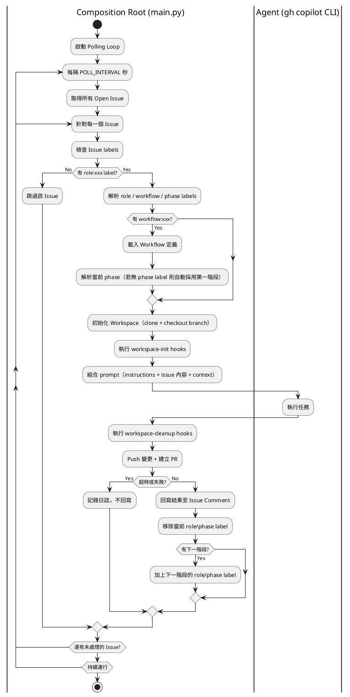

# 01 - 需求定義

## 概要

開發一個綁定 GitHub Issue 執行的 Agent 程式。程式定期監視指定 GitHub Repo 的 Issue，偵測到帶有 `role:xxx` label 的 Issue 後啟動 `gh copilot` CLI Agent 執行任務，並將執行結果回寫至 Issue。支援多角色 Workflow 自動串接。

## 核心功能

- 定期掃描指定 GitHub Repo 的所有 Open 狀態 Issue
- 以 `role:xxx` label 存在與否作為觸發依據（無需時間戳比對）
- 根據 Issue label 分派對應角色的 Agent 執行任務
- 支援多階段 Workflow：Agent 完成後自動轉換到下一角色/階段
- Agent 執行完畢後，將結果總結回寫為 Issue Comment
- 超時（預設 15 分鐘）強制終止 Agent，不回寫
- 支援多 repo workspace：自動 clone、建立 feature branch、push 變更、開 PR

## 實現限制

| 項目 | 限制 |
|---|---|
| Agent 執行器 | `gh copilot` CLI（`--yolo` 模式） |
| 容器化 | 使用 Docker 配置 Agent 環境 |
| 控制層 | Python 腳本控制流程，Shell 腳本處理認證與啟動 |

## Agent 執行方式

使用 `gh copilot` CLI 的非互動模式：

```bash
gh copilot -p "<prompt>" --yolo --no-ask-user --add-dir /workspace
```

- `-p`：非互動模式，給 prompt 後執行完畢自動退出
- `--yolo`：全部權限自動允許（等同 `--allow-all-tools --allow-all-paths --allow-all-urls`）
- `--no-ask-user`：Agent 不反問，完全自主執行
- `--add-dir /workspace`：指定 Agent 可存取的工作目錄

可選旗標：
- `--model <model>`：指定 LLM 模型（由 Workflow YAML 或環境變數決定）
- 其他 `extra-flags`：由 Workflow YAML 定義

## 系統流程



## 使用方式

- 監視程式為 Docker 容器，包含常駐 Python 腳本與 `gh copilot` 執行環境
- GitHub 認證情報以 Docker Volume 外掛 mount（read-only）
- 提供小工具讓 User 簡單設定 gh 認證情報

## 可設定項目

| 項目 | 說明 | 預設值 |
|---|---|---|
| 監控目標 Repo | `TARGET_ISSUE_REPO`（`owner/repo` 格式） | **必填** |
| 輪詢間隔 | `POLL_INTERVAL`（秒） | `60` |
| Agent 超時 | `AGENT_TIMEOUT`（秒） | `900`（15 分鐘）|
| AI 模型 | `COPILOT_MODEL`（gh copilot 支援的模型名） | 不指定（用預設）|
| 預設角色 | `DEFAULT_ROLE` | `default` |
| 啟用角色 | `ENABLED_AGENTS`（逗號分隔，空=全部） | 空（全部啟用） |
| Workflow 檔案 | `WORKFLOW_FILE` | `/app/workflows/default.yml` |

## 角色系統

根據 Issue label 分派不同 Agent 角色：

| 角色 | Label | 說明 |
|------|-------|------|
| default | `role:default` | 通用 AI 助手 |
| manager | `role:manager` | 需求分析、任務分解 |
| architect | `role:architect` | 系統設計、架構規劃 |
| coder | `role:coder` | 程式實作 |
| qa | `role:qa` | 品質驗證、測試 |

- 一個 Issue 同一時間只有一個角色在處理
- 每個角色有獨立的 instructions 設定
- 可透過 `ENABLED_AGENTS` 限制啟用的角色

## Workflow 系統

- 透過 Workflow YAML 定義多階段任務的執行順序
- Issue 加上 `role:xxx` + `workflow:xxx` label 即可啟動
- Agent 完成每個階段後自動轉換到下一角色/階段
- 支援指定多個工作 repo，自動 clone 並建立 feature branch
