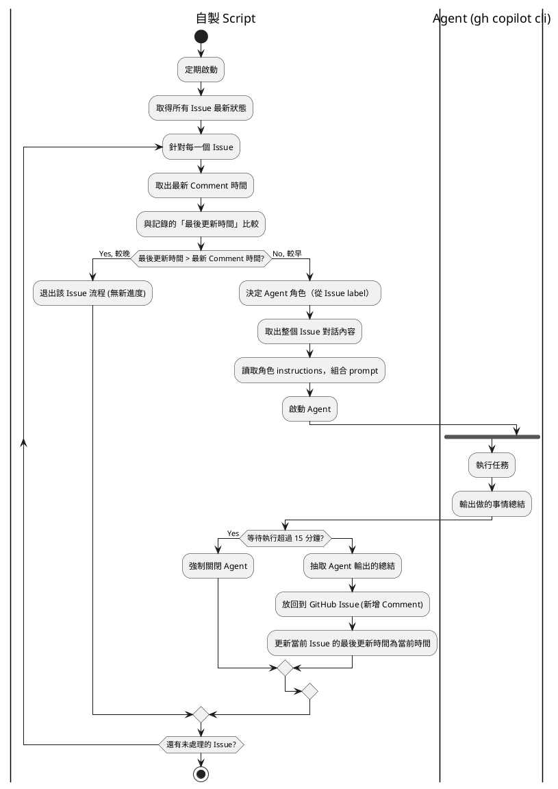

# 01 - 需求定義

## 概要

開發一個綁定 GitHub Issue 執行的 Agent 程式。程式定期監視指定 GitHub Repo 的 Issue，偵測到新的 Comment 後啟動 `gh copilot` CLI Agent 執行任務，並將執行結果回寫至 Issue。

## 核心功能

- 定期掃描指定 GitHub Repo 的所有 Open 狀態 Issue
- 偵測 Issue 是否有新進度（新 Comment）
- 有新進度時，取出 Issue 完整對話，啟動 Agent 執行任務
- Agent 執行完畢後，將結果總結回寫為 Issue Comment
- 超時（預設 15 分鐘）強制終止 Agent，不回寫

## 實現限制

| 項目 | 限制 |
|---|---|
| Agent 執行器 | `gh copilot` CLI（`--yolo` 模式） |
| 容器化 | 使用 Docker 配置 Agent 環境 |
| 控制層 | 使用自製 Shell Script 控制啟動、執行 |

## Agent 執行方式

使用 `gh copilot` CLI 的非互動模式：

```bash
gh copilot -p "<prompt>" --yolo -s --no-ask-user
```

- `-p`：非互動模式，給 prompt 後執行完畢自動退出
- `--yolo`：全部權限自動允許（等同 `--allow-all-tools --allow-all-paths --allow-all-urls`）
- `-s` / `--silent`：只輸出 Agent 回應，適合腳本抽取結果
- `--no-ask-user`：Agent 不反問，完全自主執行

## 系統流程



## 使用方式

- 監視程式為 Docker 容器，包含常駐 Script 與 `gh copilot` 執行環境
- GitHub 認證情報以 Docker Volume 外掛 mount（read-only）
- 提供小工具讓 User 簡單設定 gh 認證情報

## 可設定項目

| 項目 | 說明 | 預設值 |
|---|---|---|
| 監控目標 Repo | `owner/repo` 格式 | **必填** |
| 輪詢間隔 | 秒數，透過環境變數設定 | `60` |
| Agent 超時 | 秒數 | `900`（15 分鐘）|
| AI 模型 | gh copilot 支援的模型名 | 不指定（用預設）|
| 預設角色 | Agent 角色名 | `default` |

## 未來擴展

- **多角色分派**：根據 Issue label 分派不同 Agent 角色（Manager / Architect / Coder / QA）
- **規則**：一個 Issue 同一時間只有一個角色在處理
- **角色自訂**：每個角色有獨立的 instructions 和設定
