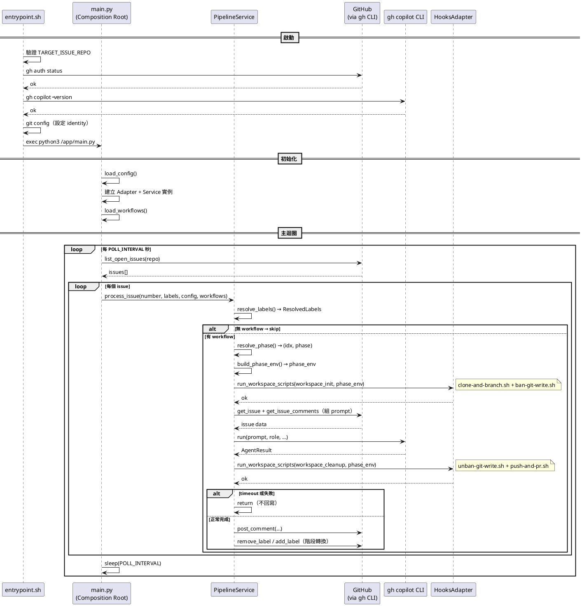

# 03 - 系統基本設計

## 1. Dockerfile

### 設計方針

- 基於 `ubuntu:24.04`
- 分階段安裝：系統套件 → Node.js → gh CLI → gh copilot CLI（全部 build time 完成）
- 容器啟動時不需要再安裝任何東西

### 詳細規格

```dockerfile
FROM ubuntu:24.04

# 系統套件（含 python3、python3-yaml）
RUN apt-get update && apt-get install -y \
    curl git jq ca-certificates gnupg python3 python3-pip python3-yaml \
    && rm -rf /var/lib/apt/lists/*

# Node.js (gh copilot CLI 內含 Node.js runtime，但 npx 等工具仍需系統 Node)
RUN curl -fsSL https://deb.nodesource.com/setup_22.x | bash - \
    && apt-get install -y nodejs \
    && rm -rf /var/lib/apt/lists/*

# GitHub CLI
RUN curl -fsSL https://cli.github.com/packages/githubcli-archive-keyring.gpg \
    | dd of=/usr/share/keyrings/githubcli-archive-keyring.gpg \
    && echo "deb [arch=$(dpkg --print-architecture) signed-by=...] ..." \
    > /etc/apt/sources.list.d/github-cli.list \
    && apt-get update && apt-get install -y gh \
    && rm -rf /var/lib/apt/lists/*

# gh copilot CLI — build time 直接下載，跳過互動式安裝提示
# 來源：github/copilot-cli repo（非 github/gh-copilot）
# 自動偵測 CPU 架構（amd64 → x64 / arm64）
RUN DPKG_ARCH=$(dpkg --print-architecture) \
    && if [ "$DPKG_ARCH" = "amd64" ]; then COPILOT_ARCH="x64"; else COPILOT_ARCH="$DPKG_ARCH"; fi \
    && mkdir -p /root/.local/share/gh/copilot \
    && curl -sL "https://github.com/github/copilot-cli/releases/latest/download/copilot-linux-${COPILOT_ARCH}.tar.gz" \
       -o /tmp/copilot.tar.gz \
    && tar xzf /tmp/copilot.tar.gz -C /root/.local/share/gh/copilot \
    && chmod +x /root/.local/share/gh/copilot/copilot \
    && rm /tmp/copilot.tar.gz

# 工作目錄
WORKDIR /workspace

# Script
COPY scripts/ /app/
RUN chmod +x /app/entrypoint.sh

# Entrypoint
ENTRYPOINT ["/app/entrypoint.sh"]
```

### 注意事項

- Copilot binary 來源是 `github/copilot-cli` repo（v1.0.2，支援 `-p`、`--yolo`、`--agent`）
- 與 `github/gh-copilot` repo 的舊版 Go binary（僅 suggest/explain）不同
- 下載 URL 模式：`https://github.com/github/copilot-cli/releases/latest/download/copilot-{platform}-{arch}.tar.gz`
- Linux amd64 的 asset 名稱為 `copilot-linux-x64.tar.gz`（非 `amd64`），需做架構名稱映射
- 認證不在 build time 處理，改在 runtime 由 entrypoint.sh 從 ro mount copy

---

## 2. docker-compose.yml

### 詳細規格

```yaml
services:
  agent:
    build: .
    container_name: learnghagent
    restart: unless-stopped
    environment:
      - TARGET_ISSUE_REPO=${TARGET_ISSUE_REPO}
      - POLL_INTERVAL=${POLL_INTERVAL:-60}
      - AGENT_TIMEOUT=${AGENT_TIMEOUT:-900}
      - COPILOT_MODEL=${COPILOT_MODEL:-}
      - DEFAULT_ROLE=${DEFAULT_ROLE:-default}
      - ENABLED_AGENTS=${ENABLED_AGENTS:-}
      - WORKFLOW_FILE=${WORKFLOW_FILE:-/app/workflows/default.yml}
    volumes:
      - ./auth/hosts.yml:/auth-src/hosts.yml:ro   # gh 認證（ro，entrypoint copy 到可寫位置）
      - ./agents:/app/agents:ro                    # Agent 角色定義
      - ./workflows:/app/workflows:ro              # Workflow 定義
      - ./workspace-scripts:/app/workspace-scripts:ro  # Workspace hook scripts
      - ./workspace:/workspace                     # Agent 工作區
```

### 使用方式

```bash
# 啟動
TARGET_ISSUE_REPO=owner/repo docker compose up -d

# 查看 log
docker compose logs -f

# 停止
docker compose down
```

---

## 3. scripts/entrypoint.sh

### 職責

- 從 ro mount 複製認證檔案到可寫位置
- 驗證必要環境變數（`TARGET_ISSUE_REPO`）
- 驗證 gh 認證有效
- 確認 gh copilot CLI 可用
- 設定 git identity
- 啟動 main.py

### 詳細虛擬碼

```shell
#!/usr/bin/env bash
set -euo pipefail

log(level, msg):
    echo "[$(date -u +%Y-%m-%dT%H:%M:%SZ)] [${level}] ${msg}"

# --- Auth 設定（從 ro mount copy 到可寫位置）---
log INFO "Setting up auth..."
if [ ! -f /auth-src/hosts.yml ]:
    log ERROR "Auth file not found. Mount hosts.yml to /auth-src/hosts.yml"
    exit 1

mkdir -p /root/.config/gh
cp /auth-src/hosts.yml /root/.config/gh/hosts.yml
chmod 600 /root/.config/gh/hosts.yml

# --- 驗證 ---
if TARGET_ISSUE_REPO 為空:
    log ERROR "TARGET_ISSUE_REPO is required"
    exit 1

log INFO "Verifying gh auth..."
if ! gh auth status:
    log ERROR "gh auth failed. Check auth/hosts.yml content."
    exit 1

log INFO "Verifying gh copilot..."
if ! gh copilot -- --version:
    log ERROR "gh copilot CLI not found. Dockerfile build may have failed."
    exit 1

# --- Git config ---
git config --global user.name "GitHub Issue Agent"
git config --global user.email "agent@learnghagent.local"
git config --global --add safe.directory '*'
git config --global credential.helper '!gh auth git-credential'
log INFO "Git identity configured"

# --- 啟動主迴圈 ---
log INFO "Starting agent loop for ${TARGET_ISSUE_REPO}"
log INFO "Poll interval: ${POLL_INTERVAL:-60}s, Timeout: ${AGENT_TIMEOUT:-900}s"

exec python3 /app/main.py
```

---

## 4. Hexagonal Architecture 模組設計

### 架構總覽

```
scripts/
├── main.py                     # Composition Root（Inbound Adapter + Polling Loop）
├── config.py                   # Config dataclass + load_config()
├── domain/                     # Domain Model — 純資料結構，零依賴
│   ├── models.py               # AgentResult, ResolvedLabels
│   └── workflow.py             # Workflow, Phase, RepoConfig dataclasses
├── ports/                      # Port — 介面定義（typing.Protocol）
│   ├── github_port.py          # GitHubPort
│   ├── agent_port.py           # AgentPort
│   └── hooks_port.py           # HooksPort
├── services/                   # Service — 業務邏輯（依賴 Port + Domain）
│   ├── pipeline.py             # process_issue()：主流程編排
│   ├── workflow_service.py     # YAML 載入、phase 導航、階段轉換
│   ├── role_service.py         # label 解析 → ResolvedLabels
│   └── prompt_service.py       # prompt 組裝（含 workflow/repos/phase-prompt context）
└── adapters/                   # Outbound Adapter — 實作 Port 介面
    ├── github_adapter.py       # 實作 GitHubPort（gh CLI）
    ├── agent_adapter.py        # 實作 AgentPort（gh copilot CLI）
    └── hooks_adapter.py        # 實作 HooksPort（subprocess，支援 phase_env）
```

依賴方向：`main.py` → `services/` → `ports/` + `domain/` ← `adapters/`

### 4.1 Domain Model（domain/）

#### domain/models.py

```python
@dataclass
class AgentResult:
    exit_code: int
    output: str
    timed_out: bool

@dataclass
class ResolvedLabels:
    role: str           # 角色名（e.g. "coder"，空字串表示無匹配）
    role_label: str     # 完整 label 字串（e.g. "role:manager"）
    workflow_name: str  # workflow 名（e.g. "full-development"，空字串表示無）
    phase_name: str     # phase 名（e.g. "implementation"，空字串表示無）
```

#### domain/workflow.py

```python
@dataclass
class RepoConfig:
    repo: str           # owner/repo 格式
    url: str = ""       # 可選的 git URL override（空 = 用 gh repo clone）
    description: str = ""

@dataclass
class Phase:
    role: str
    phasename: str
    phase_prompt: str = ""
    llm_model: str = ""
    workspace_init: list[str] = field(default_factory=list)
    workspace_cleanup: list[str] = field(default_factory=list)
    phase_env: dict[str, str] = field(default_factory=dict)

@dataclass
class Workflow:
    name: str
    repos: list[RepoConfig] = field(default_factory=list)
    phases: list[Phase] = field(default_factory=list)
```

### 4.2 Port 介面定義（ports/）

所有 Port 使用 `typing.Protocol` 定義，Service 僅依賴這些介面。

#### ports/github_port.py

```python
class GitHubPort(Protocol):
    def list_open_issues(self, repo: str) -> list[dict[str, Any]]: ...
    def get_issue(self, repo: str, number: int) -> dict[str, Any]: ...
    def get_issue_comments(self, repo: str, number: int) -> list[dict[str, Any]]: ...
    def post_comment(self, repo: str, number: int, body: str) -> None: ...
    def add_label(self, repo: str, number: int, label: str) -> None: ...
    def remove_label(self, repo: str, number: int, label: str) -> None: ...
```

> 所有 `repo` 參數使用 `owner/repo` 格式。

#### ports/agent_port.py

```python
class AgentPort(Protocol):
    def run(
        self,
        prompt: str,
        role: str,
        agents_dir: str,
        timeout: int,
        model: str,
    ) -> AgentResult: ...
```

#### ports/hooks_port.py

```python
class HooksPort(Protocol):
    def run_workspace_scripts(
        self,
        script_names: list[str],
        phase_env: dict[str, str] | None = None,
    ) -> bool:
        """Execute a list of workspace scripts sequentially.

        Args:
            script_names: List of script filenames to run.
            phase_env: Extra environment variables passed to each script.

        Returns True if all scripts succeeded, False if any failed."""
        ...
```

### 4.3 Service 業務邏輯（services/）

> ℹ️ 以下為簡化虛擬碼。Service 透過建構式接收 Port 介面。

#### services/role_service.py

```python
class RoleService:
    def resolve_labels(self, labels: list[dict], agents_dir: str,
                       enabled_agents: list[str]) -> ResolvedLabels:
        # 從 label 列表解析 role:xxx / workflow:xxx / phase:xxx
        # 驗證 role 對應的 agents/ 子目錄存在
        # 檢查 enabled_agents 過濾
        return ResolvedLabels(role, role_label, workflow_name, phase_name)
```

#### services/workflow_service.py

```python
class WorkflowService:
    def __init__(self, github_port: GitHubPort):
        self.github = github_port

    def load_workflows(self, workflow_file: str) -> dict[str, Workflow]:
        # 載入 YAML，解析為 Workflow/Phase/RepoConfig 資料結構
        # 支援新格式（config + steps）和舊格式（flat list）
        ...

    def resolve_phase(self, workflow: Workflow, phase_name: str | None,
                      repo: str, issue_number: int) -> tuple[int | None, Phase | None]:
        # 若有 phase_name → 查找對應 phase
        # 若無 phase_name → 自動採用第一階段，補上 phase label
        # 回傳 (phase_idx, phase)
        ...

    def advance_phase(self, workflow: Workflow, phase_idx: int,
                      resolved: ResolvedLabels, repo: str, issue_number: int) -> bool:
        # 移除當前 role/phase label
        # 若有下一階段 → 加上下一階段 role/phase label，回傳 True
        # 若已完成 → 回傳 False
        ...
```

#### services/prompt_service.py

```python
class PromptService:
    def __init__(self, github_port: GitHubPort):
        self.github = github_port

    def build_prompt(self, repo: str, issue_number: int, role: str,
                     agents_dir: str, phase: Phase | None,
                     workflow_repos: list[RepoConfig]) -> str:
        # 1. 從 github_port 取得 issue body + comments
        # 2. 讀取 agents/{role}/instructions.md
        # 3. 加入 phase context（phase_prompt，支援 {BRANCH_NAME}/{ISSUE_NUMBER} 佔位符）
        # 4. 加入 repos context（clone 位置、repo 說明）
        # 5. 組合完整 prompt
        ...
```

#### services/pipeline.py（主流程編排）

```python
class PipelineService:
    def __init__(self, github_port: GitHubPort,
                 agent_port: AgentPort, hooks_port: HooksPort,
                 role_service: RoleService, workflow_service: WorkflowService,
                 prompt_service: PromptService):
        # 儲存所有依賴

    def process_issue(self, number: int, labels: list[dict],
                      config: Config, workflows: dict[str, Workflow]):
        # Step 1: 解析 labels
        resolved = self.role_service.resolve_labels(labels, ...)
        if not resolved.workflow_name:
            return

        # Step 2: 解析 workflow/phase
        if resolved.workflow_name in workflows:
            workflow_service.resolve_phase(...) → (idx, phase)

        # Step 3: 建構 phase_env（REPOS, ISSUE_NUMBER, BRANCH_NAME 等環境變數）
        phase_env = workflow_service.build_phase_env(workflow, phase, number, repo)

        # Step 4: 執行 workspace-init hooks（clone-and-branch.sh + ban-git-write.sh）
        if phase and phase.workspace_init:
            init_ok = self.hooks.run_workspace_scripts(phase.workspace_init, phase_env)
            if not init_ok:
                return  # workspace-init 失敗則跳過

        # Step 5: 組 prompt
        prompt = self.prompt_service.build_prompt(
            repo, number, resolved.role, agents_dir, phase, repos)

        # Step 6: 執行 Agent
        effective_model = (phase.llm_model if phase else "") or config.copilot_model
        result = self.agent.run(
            prompt, resolved.role, config.agents_dir,
            config.agent_timeout, effective_model)

        # Step 7: 執行 workspace-cleanup hooks（unban-git-write.sh + push-and-pr.sh）
        if phase and phase.workspace_cleanup:
            self.hooks.run_workspace_scripts(phase.workspace_cleanup, phase_env)

        # Step 8: 檢查結果（timeout/failure → return）
        if result.timed_out or result.exit_code != 0:
            return

        # Step 9: 回寫 Comment
        if result.output:
            self.github.post_comment(config.target_issue_repo, number, body)

        # Step 10: 階段轉換
        if workflow:
            self.workflow_service.advance_phase(workflow, idx, ...)
```

### 4.4 Outbound Adapter（adapters/）

各 Adapter 實作對應的 Port 介面，封裝外部 I/O。

#### adapters/github_adapter.py

```python
class GhCliGitHubAdapter:
    """透過 gh CLI 實作 GitHubPort"""
    def list_open_issues(self, repo: str) -> list[dict]:
        # gh issue list --repo {repo} --state open --json number,labels --limit 100
        ...
    def get_issue(self, repo: str, number: int) -> dict:
        # repo split 為 owner/name → gh api repos/{owner}/{name}/issues/{number}
        ...
    def get_issue_comments(self, repo: str, number: int) -> list[dict]:
        # gh api repos/{owner}/{name}/issues/{number}/comments
        ...
    def post_comment(self, repo: str, number: int, body: str) -> None:
        # gh issue comment {number} --repo {repo} --body ...
        ...
    def add_label(self, repo: str, number: int, label: str) -> None:
        # gh issue edit {number} --repo {repo} --add-label {label}
        ...
    def remove_label(self, repo: str, number: int, label: str) -> None:
        # gh issue edit {number} --repo {repo} --remove-label {label}
        ...
```

#### adapters/agent_adapter.py

```python
class CopilotCliAgentAdapter:
    """透過 gh copilot CLI 實作 AgentPort"""
    def run(self, prompt: str, role: str, agents_dir: str,
            timeout: int, model: str) -> AgentResult:
        # 1. 組合 cmd:
        #    gh copilot -p "..." --yolo --no-ask-user --add-dir /workspace
        #    [--model MODEL]
        # 2. subprocess.Popen + threading.Timer watchdog（timeout kill）
        # 3. streaming 逐行讀取 stdout
        # 4. 回傳 AgentResult(exit_code, output, timed_out)
        ...
```

#### adapters/hooks_adapter.py

```python
class SubprocessHooksAdapter:
    """透過 subprocess 實作 HooksPort"""
    WORKSPACE_SCRIPTS_DIR = "/app/workspace-scripts"

    def __init__(self, scripts_dir: str = WORKSPACE_SCRIPTS_DIR):
        self.scripts_dir = scripts_dir

    def run_workspace_scripts(self, script_names: list[str],
                              phase_env: dict[str, str] | None = None) -> bool:
        # 依序執行 script_names 中的每個腳本
        # 腳本路徑：{scripts_dir}/{script_name}
        # phase_env 合併到 os.environ 傳給 subprocess
        # stdout 以 INFO 等級 log 輸出
        # 失敗時 log error 但繼續執行剩餘腳本
        # timeout: 300s
        # 回傳 all_ok: bool
        ...
```

### 4.5 Composition Root（main.py）

```python
def main():
    config = load_config()

    # 建立 Adapter 實例
    github_adapter = GhCliGitHubAdapter()
    agent_adapter = CopilotCliAgentAdapter()
    hooks_adapter = SubprocessHooksAdapter()

    # 建立 Service 實例，注入 Port/Adapter
    role_service = RoleService()
    workflow_service = WorkflowService(github_port=github_adapter)
    prompt_service = PromptService(github_port=github_adapter)
    pipeline = PipelineService(
        github_port=github_adapter,
        agent_port=agent_adapter,
        hooks_port=hooks_adapter,
        role_service=role_service,
        workflow_service=workflow_service,
        prompt_service=prompt_service,
    )

    # 載入 Workflow
    workflows = workflow_service.load_workflows(config.workflow_file)

    # Polling Loop
    while True:
        issues = github_adapter.list_open_issues(config.target_issue_repo)
        for issue in issues:
            pipeline.process_issue(
                issue["number"], issue["labels"], config, workflows)
        sleep(config.poll_interval)

main()
```

### 觸發機制

以 `workflow:xxx` label 存在與否作為處理依據，無需時間戳比對。Workflow 完成後設定 `phase:end`，因此下次輪詢不會重複處理。

---

## 5. scripts/setup-auth.sh

### 職責

- 在 host 端執行
- 協助 User 設定 gh 認證
- 產生含 `oauth_token` 的 `hosts.yml`（macOS Keychain 無法直接複製）

### 詳細虛擬碼

```shell
#!/usr/bin/env bash
set -euo pipefail

SCRIPT_DIR=$(cd "$(dirname "$0")" && pwd)
PROJECT_DIR=$(dirname "$SCRIPT_DIR")
AUTH_DIR="${PROJECT_DIR}/auth"

echo "=== GitHub Issue Agent - Auth Setup ==="

# Step 1: 檢查 gh CLI
if ! command -v gh:
    echo "Error: gh CLI not found. Install from https://cli.github.com/"
    exit 1

# Step 2: 確認已登入
if ! gh auth status:
    echo "Not logged in. Starting gh auth login..."
    gh auth login --hostname github.com

# Step 3: 再次驗證
if ! gh auth status:
    echo "Error: Authentication failed"
    exit 1

# Step 4: 取得 token 並產生 hosts.yml
mkdir -p "${AUTH_DIR}"
TOKEN=$(gh auth token)
USER=$(gh api user --jq '.login')

cat > "${AUTH_DIR}/hosts.yml" << EOF
github.com:
    oauth_token: ${TOKEN}
    git_protocol: https
    user: ${USER}
EOF

# Step 5: 設定權限
chmod 600 "${AUTH_DIR}/hosts.yml"

echo "=== Setup Complete ==="
echo "Auth files saved to: ${AUTH_DIR}/"
```

---

## 6. agents/

### 目錄結構

```
agents/
├── default/
│   └── instructions.md    # 預設角色的 system prompt
├── manager/
│   └── instructions.md
├── architect/
│   └── instructions.md
├── coder/
│   └── instructions.md
└── qa/
    └── instructions.md
```

每個角色目錄只需 `instructions.md` 一個檔案。model 等啟動設定集中在 Workflow YAML 中管理。

---

## 7. .gitignore

```
auth/
workspace/
```

---

## 8. 錯誤處理設計

| 情境 | 處理方式 |
|---|---|
| gh auth 失敗 | entrypoint 階段就失敗退出，log 提示檢查 mount |
| gh copilot 未安裝 | entrypoint 報錯退出（copilot 應在 Dockerfile build time 已安裝） |
| GitHub API 呼叫失敗 | log ERROR，skip 該 Issue，繼續處理下一個 |
| Agent 超時 (TimeoutExpired) | log WARN，不回寫 Comment，push partial work 後繼續下一個 Issue |
| Agent 異常退出 (非 0) | log ERROR，不回寫 Comment，push partial work 後繼續下一個 Issue |
| Agent 輸出為空 | 不回寫 Comment，僅移除 label / 推進 workflow |
| 角色目錄不存在 | fallback 到內建預設 instructions |
| Workspace-init hooks 失敗 | log error，跳過該 Issue（不執行 Agent） |

---

## 9. 日誌設計

### 格式

```
[2026-03-08T12:00:00Z] [INFO] Polling issues for owner/repo...
[2026-03-08T12:00:01Z] [INFO] Found 5 open issues
[2026-03-08T12:00:02Z] [INFO] Issue #3: processing (role=coder, workflow=full-development, phase=implementation)
[2026-03-08T12:00:02Z] [INFO] Issue #3: workflow 'full-development' phase 'implementation' (idx=2)
[2026-03-08T12:00:03Z] [INFO] Running agent with role 'coder' (timeout=900s)
[2026-03-08T12:01:30Z] [INFO] [copilot] Creating files...
[2026-03-08T12:01:30Z] [INFO] Issue #3: comment posted
[2026-03-08T12:01:31Z] [INFO] Issue #3: advanced to next phase -> role:qa phase:verification
[2026-03-08T12:01:31Z] [INFO] Sleeping 60s...
```

### 日誌等級

| 等級 | 用途 |
|---|---|
| `DEBUG` | 跳過 Issue 等細節 |
| `INFO` | 正常流程資訊 |
| `WARN` | 超時等可恢復情況 |
| `ERROR` | 認證失敗、API 錯誤等 |

日誌直接輸出到 stdout/stderr，由 Docker 收集（`docker compose logs`）。

---

## 10. 元件互動序列圖


