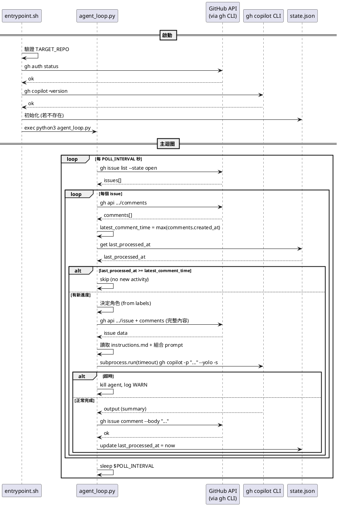

# 03 - 系統基本設計

## 1. Dockerfile

### 設計方針

- 基於 `ubuntu:24.04`
- 分階段安裝：系統套件 → Node.js → gh CLI → gh copilot CLI（全部 build time 完成）
- 容器啟動時不需要再安裝任何東西

### 詳細規格

```dockerfile
FROM ubuntu:24.04

# 系統套件（含 python3）
RUN apt-get update && apt-get install -y \
    curl git jq ca-certificates gnupg python3 \
    && rm -rf /var/lib/apt/lists/*

# Node.js (gh copilot CLI 內含 Node.js runtime，但 npx 等工具仍需系統 Node)
RUN curl -fsSL https://deb.nodesource.com/setup_22.x | bash - \
    && apt-get install -y nodejs \
    && rm -rf /var/lib/apt/lists/*

# GitHub CLI
RUN curl -fsSL https://cli.github.com/packages/githubcli-archive-keyring.gpg \
    | dd of=/usr/share/keyrings/githubcli-archive-keyring.gpg \
    && echo "deb [arch=$(dpkg --print-architecture) signed-by=...] ..." \
    > /etc/apt/sources.list.d/github-cli.list \
    && apt-get update && apt-get install -y gh \
    && rm -rf /var/lib/apt/lists/*

# gh copilot CLI — build time 直接下載，跳過互動式安裝提示
# 來源：github/copilot-cli repo（非 github/gh-copilot）
RUN mkdir -p /root/.local/share/gh/copilot \
    && curl -sL "https://github.com/github/copilot-cli/releases/latest/download/copilot-linux-arm64.tar.gz" \
       -o /tmp/copilot.tar.gz \
    && tar xzf /tmp/copilot.tar.gz -C /root/.local/share/gh/copilot \
    && chmod +x /root/.local/share/gh/copilot/copilot \
    && rm /tmp/copilot.tar.gz

# 工作目錄
WORKDIR /workspace

# Script
COPY scripts/ /app/

# Entrypoint
ENTRYPOINT ["/app/entrypoint.sh"]
```

### 注意事項

- Copilot binary 來源是 `github/copilot-cli` repo（v1.0.2，支援 `-p`、`--yolo`、`--agent`）
- 與 `github/gh-copilot` repo 的舊版 Go binary（僅 suggest/explain）不同
- 下載 URL 模式：`https://github.com/github/copilot-cli/releases/latest/download/copilot-{platform}-{arch}.tar.gz`
- 認證不在 build time 處理，改在 runtime 由 entrypoint.sh 從 ro mount copy

---

## 2. docker-compose.yml

### 詳細規格

```yaml
version: "3.8"

services:
  agent:
    build: .
    container_name: gh-issue-agent
    restart: unless-stopped
    environment:
      - TARGET_REPO=${TARGET_REPO}
      - POLL_INTERVAL=${POLL_INTERVAL:-60}
      - AGENT_TIMEOUT=${AGENT_TIMEOUT:-900}
      - COPILOT_MODEL=${COPILOT_MODEL:-}
      - DEFAULT_ROLE=${DEFAULT_ROLE:-default}
    volumes:
      - ./auth/hosts.yml:/auth-src/hosts.yml:ro   # gh 認證（ro，entrypoint copy 到可寫位置）
      - ./data:/data                               # 狀態持久化
      - ./agents:/app/agents:ro                    # Agent 角色定義
      - ./workspace:/workspace                     # Agent 工作區
```

### 使用方式

```bash
# 啟動
TARGET_REPO=owner/repo docker compose up -d

# 查看 log
docker compose logs -f

# 停止
docker compose down
```

---

## 3. scripts/entrypoint.sh

### 職責

- 從 ro mount 複製認證檔案到可寫位置
- 驗證必要環境變數
- 驗證 gh 認證有效
- 確認 gh copilot CLI 可用
- 初始化 state.json（若不存在）
- 啟動 agent_loop.py

### 詳細虛擬碼

```shell
#!/usr/bin/env bash
set -euo pipefail

log(level, msg):
    echo "[$(date -u +%Y-%m-%dT%H:%M:%SZ)] [${level}] ${msg}"

# --- Auth 設定（從 ro mount copy 到可寫位置）---
log INFO "Setting up auth..."
if [ ! -f /auth-src/hosts.yml ]:
    log ERROR "Auth file not found. Mount hosts.yml to /auth-src/hosts.yml"
    exit 1

mkdir -p /root/.config/gh
cp /auth-src/hosts.yml /root/.config/gh/hosts.yml
chmod 600 /root/.config/gh/hosts.yml

# --- 驗證 ---
if TARGET_REPO 為空:
    log ERROR "TARGET_REPO is required"
    exit 1

log INFO "Verifying gh auth..."
if ! gh auth status:
    log ERROR "gh auth failed. Check auth/hosts.yml content."
    exit 1

log INFO "Verifying gh copilot..."
if ! gh copilot -- --version:
    log ERROR "gh copilot CLI not found. Dockerfile build may have failed."
    exit 1

# --- 初始化 ---
STATE_FILE="/data/state.json"
if state.json 不存在:
    echo '{"issues":{}}' > $STATE_FILE
    log INFO "Initialized state.json"

# --- 啟動主迴圈 ---
log INFO "Starting agent loop for ${TARGET_REPO}"
log INFO "Poll interval: ${POLL_INTERVAL}s, Timeout: ${AGENT_TIMEOUT}s"

exec python3 /app/agent_loop.py
```

---

## 4. scripts/agent-loop.py（主控 Script）

### 職責

- 無限迴圈，每 POLL_INTERVAL 秒執行一次
- 取得 Open Issue 清單
- 對每個 Issue 判斷是否有新進度
- 分派角色並執行 Agent
- 回寫結果、更新狀態

### 詳細虛擬碼

```python
#!/usr/bin/env bash
set -euo pipefail

STATE_FILE="/data/state.json"
OWNER="${TARGET_REPO%%/*}"
REPO="${TARGET_REPO##*/}"

# ============================================================
# 輔助函式
# ============================================================

log(level, msg):
    echo "[$(date -u +%Y-%m-%dT%H:%M:%SZ)] [${level}] ${msg}"

# 取得 state.json 中某 Issue 的 last_processed_at
get_last_processed(issue_number):
    jq -r ".issues[\"${issue_number}\"].last_processed_at // \"\"" $STATE_FILE

# 更新 state.json 中某 Issue 的 last_processed_at
update_last_processed(issue_number, timestamp):
    tmp=$(mktemp)
    jq ".issues[\"${issue_number}\"].last_processed_at = \"${timestamp}\"" $STATE_FILE > $tmp
    mv $tmp $STATE_FILE

# 從 Issue labels 取得角色名
get_role_from_labels(labels_json):
    # labels_json 格式: [{"name":"bug"},{"name":"role:coder"}]
    role = echo $labels_json | jq -r '.[] | select(.name | startswith("role:")) | .name | sub("role:";"")' | head -1
    if role 為空:
        echo "${DEFAULT_ROLE}"
    else:
        echo "${role}"

# ============================================================
# Issue 處理函式
# ============================================================

get_latest_comment_time(issue_number):
    # 取得 Issue 本身的 created_at 作為基準
    issue_created=$(gh api "repos/${OWNER}/${REPO}/issues/${issue_number}" --jq '.created_at')
    
    # 取得所有 comments 的最新時間
    latest_comment=$(gh api "repos/${OWNER}/${REPO}/issues/${issue_number}/comments" \
        --jq 'map(.created_at) | sort | last // empty')
    
    # 回傳較晚的那個（若無 comment 則用 issue 建立時間）
    if latest_comment 為空:
        echo "${issue_created}"
    else:
        echo "${latest_comment}"

build_prompt(issue_number, role):
    # 取 Issue body
    issue_data=$(gh api "repos/${OWNER}/${REPO}/issues/${issue_number}" \
        --jq '{title: .title, body: .body, user: .user.login}')
    
    title=$(echo $issue_data | jq -r '.title')
    body=$(echo $issue_data | jq -r '.body')
    author=$(echo $issue_data | jq -r '.user')
    
    # 取所有 comments
    comments=$(gh api "repos/${OWNER}/${REPO}/issues/${issue_number}/comments" \
        --jq '.[] | "[\(.user.login) at \(.created_at)]:\n\(.body)\n"')
    
    # 讀取角色 instructions
    role_dir="/app/agents/${role}"
    if [ -f "${role_dir}/instructions.md" ]:
        instructions=$(cat "${role_dir}/instructions.md")
    else:
        instructions="You are an AI assistant. Execute the task described in the issue."
    
    # 組合完整 prompt
    prompt="${instructions}

---

# Issue #${issue_number}: ${title}

**Author:** ${author}

## Description
${body}

## Comments
${comments}

---

Please execute the task and provide a summary of what you did."
    
    echo "${prompt}"

run_agent(issue_number, role, prompt):
    log INFO "Running agent for issue #${issue_number} with role '${role}'"
    
    # ℹ️ 已調整：config.json 已移除，model/extra_flags 改由 Workflow YAML 傳入
    # 詳見 05-design-adjustments.md 調整二
    role_dir="/app/agents/${role}"
    
    model=""
    extra_flags=""
    if [ -f "${config}" ]:
        model=$(jq -r '.model // empty' "${config}")
        extra_flags=$(jq -r '.extra_flags // empty' "${config}")
    
    # 組合 gh copilot 指令
    cmd_args=(-p "${prompt}" --yolo -s --no-ask-user --add-dir /workspace)
    
    if model 不為空:
        cmd_args+=(--model "${model}")
    elif COPILOT_MODEL 不為空:
        cmd_args+=(--model "${COPILOT_MODEL}")
    
    # 帶超時執行
    output=$(timeout ${AGENT_TIMEOUT} gh copilot "${cmd_args[@]}" 2>&1)
    exit_code=$?
    
    return exit_code, output

process_issue(issue_number, labels_json):
    # Step 1: 取最新 comment 時間
    latest_time=$(get_latest_comment_time $issue_number)
    
    # Step 2: 比對 state
    last_processed=$(get_last_processed $issue_number)
    
    if last_processed 不為空 且 last_processed >= latest_time:
        log DEBUG "Issue #${issue_number}: no new activity, skipping"
        return
    
    log INFO "Issue #${issue_number}: new activity detected"
    
    # Step 3: 決定角色
    role=$(get_role_from_labels $labels_json)
    
    # Step 4: 組 prompt
    prompt=$(build_prompt $issue_number $role)
    
    # Step 5: 執行 Agent
    exit_code, output = run_agent $issue_number $role "$prompt"
    
    if exit_code == 124:
        log WARN "Issue #${issue_number}: agent timed out after ${AGENT_TIMEOUT}s"
        return
    elif exit_code != 0:
        log ERROR "Issue #${issue_number}: agent failed with exit code ${exit_code}"
        return
    
    # Step 6: 回寫 Comment
    if output 不為空:
        comment_body="## Agent Report (role: ${role})

${output}"
        gh issue comment "${issue_number}" --repo "${TARGET_REPO}" --body "${comment_body}"
        log INFO "Issue #${issue_number}: comment posted"
    
    # Step 7: 更新 state
    now=$(date -u +%Y-%m-%dT%H:%M:%SZ)
    update_last_processed $issue_number $now
    log INFO "Issue #${issue_number}: state updated"

# ============================================================
# 主迴圈
# ============================================================

main():
    while true:
        log INFO "Polling issues for ${TARGET_REPO}..."
        
        # 取得所有 open issues
        issues=$(gh issue list --repo "${TARGET_REPO}" --state open \
            --json number,labels --limit 100)
        
        count=$(echo $issues | jq length)
        log INFO "Found ${count} open issues"
        
        # 逐一處理
        for i in 0..count-1:
            number=$(echo $issues | jq -r ".[${i}].number")
            labels=$(echo $issues | jq ".[${i}].labels")
            
            process_issue $number "$labels"
        done
        
        log INFO "Sleeping ${POLL_INTERVAL}s..."
        sleep ${POLL_INTERVAL}

main
```

### 時間比較邏輯

GitHub API 回傳 ISO 8601 格式（`2026-03-07T12:00:00Z`），在 bash 中比較方式：

```bash
# 字串比較即可（ISO 8601 格式的字串排序 = 時間排序）
if [[ "${last_processed}" > "${latest_time}" ]] || [[ "${last_processed}" == "${latest_time}" ]]; then
    # 無新進度
fi
```

---

## 5. scripts/setup-auth.sh

### 職責

- 在 host 端執行
- 協助 User 設定 gh 認證
- 產生含 `oauth_token` 的 `hosts.yml`（macOS Keychain 無法直接複製）

### 詳細虛擬碼

```shell
#!/usr/bin/env bash
set -euo pipefail

SCRIPT_DIR=$(cd "$(dirname "$0")" && pwd)
PROJECT_DIR=$(dirname "$SCRIPT_DIR")
AUTH_DIR="${PROJECT_DIR}/auth"

echo "=== GitHub Issue Agent - Auth Setup ==="

# Step 1: 檢查 gh CLI
if ! command -v gh:
    echo "Error: gh CLI not found. Install from https://cli.github.com/"
    exit 1

# Step 2: 確認已登入
if ! gh auth status:
    echo "Not logged in. Starting gh auth login..."
    gh auth login --hostname github.com

# Step 3: 再次驗證
if ! gh auth status:
    echo "Error: Authentication failed"
    exit 1

# Step 4: 取得 token 並產生 hosts.yml
# macOS 的 token 存在 Keychain，無法直接複製 hosts.yml
# 必須用 gh auth token 取得後，自行產生舊版單帳號格式
mkdir -p "${AUTH_DIR}"
TOKEN=$(gh auth token)
USER=$(gh api user --jq '.login')

cat > "${AUTH_DIR}/hosts.yml" << EOF
github.com:
    oauth_token: ${TOKEN}
    git_protocol: https
    user: ${USER}
EOF

# Step 5: 設定權限
chmod 600 "${AUTH_DIR}/hosts.yml"

echo ""
echo "=== Setup Complete ==="
echo "Auth files saved to: ${AUTH_DIR}/"
echo "You can now start the agent with:"
echo "  TARGET_REPO=owner/repo docker compose up -d"
```

---

## 6. agents/default/

### instructions.md

```markdown
You are an AI assistant working on GitHub Issues.

Your task is to read the issue description and comments, understand what is being requested, and execute the task.

## Rules
- Work within the /workspace directory
- Provide a clear summary of what you did at the end
- If the task is unclear, describe what you understood and what you attempted
- Be concise in your summary
```

### config.json

> **ℹ️ 已調整**：`config.json` 已移除，model 和 extra_flags 改由 Workflow YAML 集中管理。詳見 [05-design-adjustments.md](05-design-adjustments.md) 調整二。

```json
{
  "model": "",
  "extra_flags": ""
}
```

---

## 7. .gitignore

```
auth/
data/state.json
workspace/
```

---

## 8. 錯誤處理設計

| 情境 | 處理方式 |
|---|---|
| gh auth 失敗 | entrypoint 階段就失敗退出，log 提示檢查 mount |
| gh copilot 未安裝 | entrypoint 報錯退出（copilot 應在 Dockerfile build time 已安裝） |
| GitHub API 呼叫失敗 | log ERROR，skip 該 Issue，繼續處理下一個 |
| Agent 超時 (TimeoutExpired) | log WARN，不回寫 Comment，繼續下一個 Issue |
| Agent 異常退出 (非 0) | log ERROR，不回寫 Comment，繼續下一個 Issue |
| Agent 輸出為空 | 不回寫 Comment，僅更新 state |
| state.json 讀寫失敗 | log ERROR，skip 該 Issue |
| 角色目錄不存在 | fallback 到內建預設 instructions |
| prompt 過長 | 暫不處理（v1），未來可截斷或摘要 |

---

## 9. 日誌設計

### 格式

```
[2026-03-07T12:00:00Z] [INFO] Polling issues for owner/repo...
[2026-03-07T12:00:01Z] [INFO] Found 5 open issues
[2026-03-07T12:00:01Z] [DEBUG] Issue #1: no new activity, skipping
[2026-03-07T12:00:02Z] [INFO] Issue #3: new activity detected
[2026-03-07T12:00:02Z] [INFO] Running agent for issue #3 with role 'default'
[2026-03-07T12:01:30Z] [INFO] Issue #3: comment posted
[2026-03-07T12:01:30Z] [INFO] Issue #3: state updated
[2026-03-07T12:01:30Z] [INFO] Sleeping 60s...
```

### 日誌等級

| 等級 | 用途 |
|---|---|
| `DEBUG` | 跳過 Issue 等細節 |
| `INFO` | 正常流程資訊 |
| `WARN` | 超時等可恢復情況 |
| `ERROR` | 認證失敗、API 錯誤等 |

日誌直接輸出到 stdout/stderr，由 Docker 收集（`docker compose logs`）。

---

## 10. 元件互動序列圖


