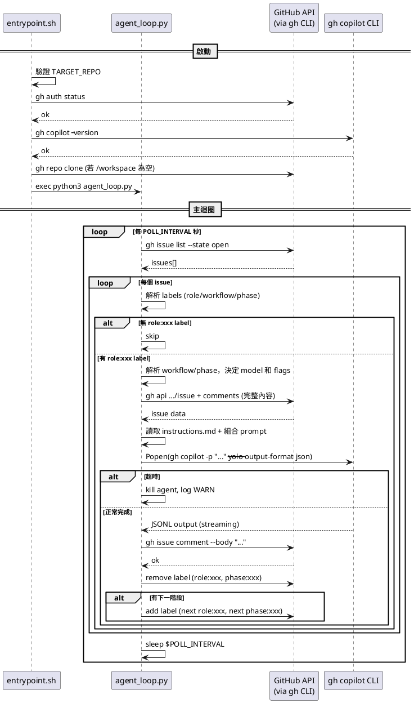

# 03 - 系統基本設計

## 1. Dockerfile

### 設計方針

- 基於 `ubuntu:24.04`
- 分階段安裝：系統套件 → Node.js → gh CLI → gh copilot CLI（全部 build time 完成）
- 容器啟動時不需要再安裝任何東西

### 詳細規格

```dockerfile
FROM ubuntu:24.04

# 系統套件（含 python3、python3-yaml）
RUN apt-get update && apt-get install -y \
    curl git jq ca-certificates gnupg python3 python3-pip python3-yaml \
    && rm -rf /var/lib/apt/lists/*

# Node.js (gh copilot CLI 內含 Node.js runtime，但 npx 等工具仍需系統 Node)
RUN curl -fsSL https://deb.nodesource.com/setup_22.x | bash - \
    && apt-get install -y nodejs \
    && rm -rf /var/lib/apt/lists/*

# GitHub CLI
RUN curl -fsSL https://cli.github.com/packages/githubcli-archive-keyring.gpg \
    | dd of=/usr/share/keyrings/githubcli-archive-keyring.gpg \
    && echo "deb [arch=$(dpkg --print-architecture) signed-by=...] ..." \
    > /etc/apt/sources.list.d/github-cli.list \
    && apt-get update && apt-get install -y gh \
    && rm -rf /var/lib/apt/lists/*

# gh copilot CLI — build time 直接下載，跳過互動式安裝提示
# 來源：github/copilot-cli repo（非 github/gh-copilot）
# 自動偵測 CPU 架構（amd64 → x64 / arm64）
RUN DPKG_ARCH=$(dpkg --print-architecture) \
    && if [ "$DPKG_ARCH" = "amd64" ]; then COPILOT_ARCH="x64"; else COPILOT_ARCH="$DPKG_ARCH"; fi \
    && mkdir -p /root/.local/share/gh/copilot \
    && curl -sL "https://github.com/github/copilot-cli/releases/latest/download/copilot-linux-${COPILOT_ARCH}.tar.gz" \
       -o /tmp/copilot.tar.gz \
    && tar xzf /tmp/copilot.tar.gz -C /root/.local/share/gh/copilot \
    && chmod +x /root/.local/share/gh/copilot/copilot \
    && rm /tmp/copilot.tar.gz

# 工作目錄
WORKDIR /workspace

# Script
COPY scripts/ /app/
RUN chmod +x /app/entrypoint.sh

# Entrypoint
ENTRYPOINT ["/app/entrypoint.sh"]
```

### 注意事項

- Copilot binary 來源是 `github/copilot-cli` repo（v1.0.2，支援 `-p`、`--yolo`、`--agent`）
- 與 `github/gh-copilot` repo 的舊版 Go binary（僅 suggest/explain）不同
- 下載 URL 模式：`https://github.com/github/copilot-cli/releases/latest/download/copilot-{platform}-{arch}.tar.gz`
- Linux amd64 的 asset 名稱為 `copilot-linux-x64.tar.gz`（非 `amd64`），需做架構名稱映射
- 認證不在 build time 處理，改在 runtime 由 entrypoint.sh 從 ro mount copy

---

## 2. docker-compose.yml

### 詳細規格

```yaml
services:
  agent:
    build: .
    container_name: learnghagent
    restart: unless-stopped
    environment:
      - TARGET_REPO=${TARGET_REPO}
      - POLL_INTERVAL=${POLL_INTERVAL:-60}
      - AGENT_TIMEOUT=${AGENT_TIMEOUT:-900}
      - COPILOT_MODEL=${COPILOT_MODEL:-}
      - DEFAULT_ROLE=${DEFAULT_ROLE:-default}
      - ENABLED_AGENTS=${ENABLED_AGENTS:-}
      - WORKFLOW_FILE=${WORKFLOW_FILE:-/app/workflows/default.yml}
    volumes:
      - ./auth/hosts.yml:/auth-src/hosts.yml:ro   # gh 認證（ro，entrypoint copy 到可寫位置）
      - ./agents:/app/agents:ro                    # Agent 角色定義
      - ./workflows:/app/workflows:ro              # Workflow 定義
      - ./workspace:/workspace                     # Agent 工作區
```

### 使用方式

```bash
# 啟動
TARGET_REPO=owner/repo docker compose up -d

# 查看 log
docker compose logs -f

# 停止
docker compose down
```

---

## 3. scripts/entrypoint.sh

### 職責

- 從 ro mount 複製認證檔案到可寫位置
- 驗證必要環境變數
- 驗證 gh 認證有效
- 確認 gh copilot CLI 可用
- Auto-clone TARGET_REPO 到 /workspace（若未 clone）
- 啟動 agent_loop.py

### 詳細虛擬碼

```shell
#!/usr/bin/env bash
set -euo pipefail

log(level, msg):
    echo "[$(date -u +%Y-%m-%dT%H:%M:%SZ)] [${level}] ${msg}"

# --- Auth 設定（從 ro mount copy 到可寫位置）---
log INFO "Setting up auth..."
if [ ! -f /auth-src/hosts.yml ]:
    log ERROR "Auth file not found. Mount hosts.yml to /auth-src/hosts.yml"
    exit 1

mkdir -p /root/.config/gh
cp /auth-src/hosts.yml /root/.config/gh/hosts.yml
chmod 600 /root/.config/gh/hosts.yml

# --- 驗證 ---
if TARGET_REPO 為空:
    log ERROR "TARGET_REPO is required"
    exit 1

log INFO "Verifying gh auth..."
if ! gh auth status:
    log ERROR "gh auth failed. Check auth/hosts.yml content."
    exit 1

log INFO "Verifying gh copilot..."
if ! gh copilot -- --version:
    log ERROR "gh copilot CLI not found. Dockerfile build may have failed."
    exit 1

# --- Auto-clone TARGET_REPO ---
if /workspace 為空:
    log INFO "Cloning ${TARGET_REPO} into /workspace..."
    gh repo clone "${TARGET_REPO}" /workspace

# --- 啟動主迴圈 ---
log INFO "Starting agent loop for ${TARGET_REPO}"
log INFO "Poll interval: ${POLL_INTERVAL}s, Timeout: ${AGENT_TIMEOUT}s"

exec python3 /app/agent_loop.py
```

---

## 4. scripts/agent-loop.py（主控 Script）

### 職責

- 無限迴圈，每 POLL_INTERVAL 秒執行一次
- 取得 Open Issue 清單
- 對每個 Issue 檢查是否有 `role:xxx` label（以 label 存在與否作為觸發依據）
- 解析 workflow/phase label，分派角色並執行 Agent
- 回寫結果、執行階段轉換

### 詳細虛擬碼

> ℹ️ 實際實作為 Python（agent_loop.py），以下為簡化虛擬碼。

```python
# ============================================================
# Issue 處理函式
# ============================================================

process_issue(issue_number, labels, config, workflows):
    # Step 1: 解析 labels
    resolved = resolve_labels(labels, config.agents_dir, config.enabled_agents)
    
    if 無 role:
        return  # skip
    
    log INFO "Issue #${issue_number}: processing (role=${resolved.role})"
    
    # Step 2: 解析 workflow/phase
    if resolved.workflow_name in workflows:
        workflow = workflows[resolved.workflow_name]
        if resolved.phase_name:
            phase_idx = find_phase_by_label(workflow, resolved.phase_name)
        if phase_idx is None:
            phase_idx = 0  # 預設第一階段
            add_label(repo, issue_number, f"phase:{workflow.phases[0].phasename}")
        phase_model = workflow.phases[phase_idx].llm_model
        phase_extra_flags = workflow.phases[phase_idx].extra_flags
    
    # Step 3: 組 prompt
    issue = get_issue(owner, repo, issue_number)
    comments = get_issue_comments(owner, repo, issue_number)
    prompt = build_prompt(issue, comments, resolved.role, agents_dir,
                          extra_context=phase_context)
    
    # Step 4: 執行 Agent
    effective_model = phase_model or config.copilot_model
    result = run_agent(prompt, role, agents_dir, timeout, effective_model, phase_extra_flags)
    
    if result.timed_out or result.exit_code != 0:
        return
    
    # Step 5: 回寫 Comment
    if result.output:
        post_comment(repo, issue_number, comment_body)
    
    # Step 6: 階段轉換
    if 有 workflow:
        remove_label(repo, issue_number, current_role_label)
        remove_label(repo, issue_number, current_phase_label)
        if 有下一階段:
            add_label(repo, issue_number, next_role_label)
            add_label(repo, issue_number, next_phase_label)
    else:
        remove_label(repo, issue_number, role_label)

# ============================================================
# 主迴圈
# ============================================================

main():
    config = load_config()
    workflows = load_workflows(config.workflow_file)
    
    while true:
        log INFO "Polling issues for ${TARGET_REPO}..."
        
        issues = list_open_issues(config.target_repo)
        log INFO "Found ${len(issues)} open issues"
        
        for issue in issues:
            number = issue.number
            labels = issue.labels
            process_issue(number, labels, config, workflows)
        
        log INFO "Sleeping ${POLL_INTERVAL}s..."
        sleep ${POLL_INTERVAL}

main
```

### 觸發機制

以 `role:xxx` label 存在與否作為處理依據，無需時間戳比對。Agent 完成後會移除 label，因此下次輪詢不會重複處理。

---

## 5. scripts/setup-auth.sh

### 職責

- 在 host 端執行
- 協助 User 設定 gh 認證
- 產生含 `oauth_token` 的 `hosts.yml`（macOS Keychain 無法直接複製）

### 詳細虛擬碼

```shell
#!/usr/bin/env bash
set -euo pipefail

SCRIPT_DIR=$(cd "$(dirname "$0")" && pwd)
PROJECT_DIR=$(dirname "$SCRIPT_DIR")
AUTH_DIR="${PROJECT_DIR}/auth"

echo "=== GitHub Issue Agent - Auth Setup ==="

# Step 1: 檢查 gh CLI
if ! command -v gh:
    echo "Error: gh CLI not found. Install from https://cli.github.com/"
    exit 1

# Step 2: 確認已登入
if ! gh auth status:
    echo "Not logged in. Starting gh auth login..."
    gh auth login --hostname github.com

# Step 3: 再次驗證
if ! gh auth status:
    echo "Error: Authentication failed"
    exit 1

# Step 4: 取得 token 並產生 hosts.yml
# macOS 的 token 存在 Keychain，無法直接複製 hosts.yml
# 必須用 gh auth token 取得後，自行產生舊版單帳號格式
mkdir -p "${AUTH_DIR}"
TOKEN=$(gh auth token)
USER=$(gh api user --jq '.login')

cat > "${AUTH_DIR}/hosts.yml" << EOF
github.com:
    oauth_token: ${TOKEN}
    git_protocol: https
    user: ${USER}
EOF

# Step 5: 設定權限
chmod 600 "${AUTH_DIR}/hosts.yml"

echo ""
echo "=== Setup Complete ==="
echo "Auth files saved to: ${AUTH_DIR}/"
echo "You can now start the agent with:"
echo "  TARGET_REPO=owner/repo docker compose up -d"
```

---

## 6. agents/default/

### instructions.md

```markdown
You are an AI assistant working on GitHub Issues.

Your task is to read the issue description and comments, understand what is being requested, and execute the task.

## Rules
- Work within the /workspace directory
- Provide a clear summary of what you did at the end
- If the task is unclear, describe what you understood and what you attempted
- Be concise in your summary
```

### ~~config.json~~（已移除）

> **ℹ️ 已調整**：`config.json` 已移除，model 和 extra_flags 改由 Workflow YAML 集中管理。詳見 [05-design-adjustments.md](05-design-adjustments.md) 調整二。

---

## 7. .gitignore

```
auth/
workspace/
```

---

## 8. 錯誤處理設計

| 情境 | 處理方式 |
|---|---|
| gh auth 失敗 | entrypoint 階段就失敗退出，log 提示檢查 mount |
| gh copilot 未安裝 | entrypoint 報錯退出（copilot 應在 Dockerfile build time 已安裝） |
| GitHub API 呼叫失敗 | log ERROR，skip 該 Issue，繼續處理下一個 |
| Agent 超時 (TimeoutExpired) | log WARN，不回寫 Comment，繼續下一個 Issue |
| Agent 異常退出 (非 0) | log ERROR，不回寫 Comment，繼續下一個 Issue |
| Agent 輸出為空 | 不回寫 Comment，僅移除 label |
| 角色目錄不存在 | fallback 到內建預設 instructions |
| prompt 過長 | 暫不處理（v1），未來可截斷或摘要 |

---

## 9. 日誌設計

### 格式

```
[2026-03-07T12:00:00Z] [INFO] Polling issues for owner/repo...
[2026-03-07T12:00:01Z] [INFO] Found 5 open issues
[2026-03-07T12:00:01Z] [INFO] Issue #1: no role label, skipping
[2026-03-07T12:00:02Z] [INFO] Issue #3: processing (role=coder)
[2026-03-07T12:00:02Z] [INFO] Running agent for issue #3 with role 'coder'
[2026-03-07T12:01:30Z] [INFO] Issue #3: comment posted
[2026-03-07T12:01:30Z] [INFO] Issue #3: removed label role:coder
[2026-03-07T12:01:30Z] [INFO] Sleeping 60s...
```

### 日誌等級

| 等級 | 用途 |
|---|---|
| `DEBUG` | 跳過 Issue 等細節 |
| `INFO` | 正常流程資訊 |
| `WARN` | 超時等可恢復情況 |
| `ERROR` | 認證失敗、API 錯誤等 |

日誌直接輸出到 stdout/stderr，由 Docker 收集（`docker compose logs`）。

---

## 10. 元件互動序列圖


