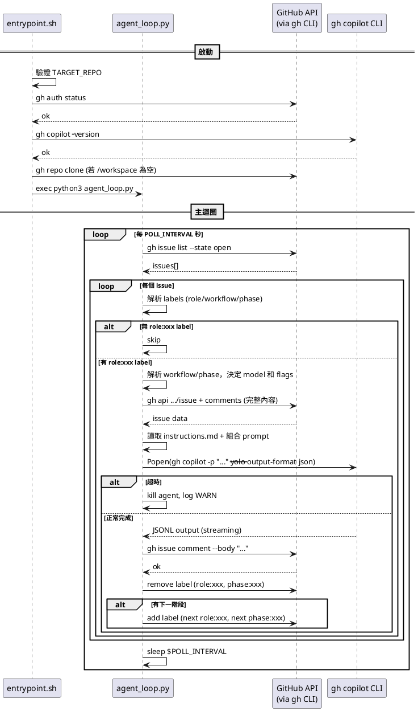

# 03 - 系統基本設計

## 1. Dockerfile

### 設計方針

- 基於 `ubuntu:24.04`
- 分階段安裝：系統套件 → Node.js → gh CLI → gh copilot CLI（全部 build time 完成）
- 容器啟動時不需要再安裝任何東西

### 詳細規格

```dockerfile
FROM ubuntu:24.04

# 系統套件（含 python3、python3-yaml）
RUN apt-get update && apt-get install -y \
    curl git jq ca-certificates gnupg python3 python3-pip python3-yaml \
    && rm -rf /var/lib/apt/lists/*

# Node.js (gh copilot CLI 內含 Node.js runtime，但 npx 等工具仍需系統 Node)
RUN curl -fsSL https://deb.nodesource.com/setup_22.x | bash - \
    && apt-get install -y nodejs \
    && rm -rf /var/lib/apt/lists/*

# GitHub CLI
RUN curl -fsSL https://cli.github.com/packages/githubcli-archive-keyring.gpg \
    | dd of=/usr/share/keyrings/githubcli-archive-keyring.gpg \
    && echo "deb [arch=$(dpkg --print-architecture) signed-by=...] ..." \
    > /etc/apt/sources.list.d/github-cli.list \
    && apt-get update && apt-get install -y gh \
    && rm -rf /var/lib/apt/lists/*

# gh copilot CLI — build time 直接下載，跳過互動式安裝提示
# 來源：github/copilot-cli repo（非 github/gh-copilot）
# 自動偵測 CPU 架構（amd64 → x64 / arm64）
RUN DPKG_ARCH=$(dpkg --print-architecture) \
    && if [ "$DPKG_ARCH" = "amd64" ]; then COPILOT_ARCH="x64"; else COPILOT_ARCH="$DPKG_ARCH"; fi \
    && mkdir -p /root/.local/share/gh/copilot \
    && curl -sL "https://github.com/github/copilot-cli/releases/latest/download/copilot-linux-${COPILOT_ARCH}.tar.gz" \
       -o /tmp/copilot.tar.gz \
    && tar xzf /tmp/copilot.tar.gz -C /root/.local/share/gh/copilot \
    && chmod +x /root/.local/share/gh/copilot/copilot \
    && rm /tmp/copilot.tar.gz

# 工作目錄
WORKDIR /workspace

# Script
COPY scripts/ /app/
RUN chmod +x /app/entrypoint.sh

# Entrypoint
ENTRYPOINT ["/app/entrypoint.sh"]
```

### 注意事項

- Copilot binary 來源是 `github/copilot-cli` repo（v1.0.2，支援 `-p`、`--yolo`、`--agent`）
- 與 `github/gh-copilot` repo 的舊版 Go binary（僅 suggest/explain）不同
- 下載 URL 模式：`https://github.com/github/copilot-cli/releases/latest/download/copilot-{platform}-{arch}.tar.gz`
- Linux amd64 的 asset 名稱為 `copilot-linux-x64.tar.gz`（非 `amd64`），需做架構名稱映射
- 認證不在 build time 處理，改在 runtime 由 entrypoint.sh 從 ro mount copy

---

## 2. docker-compose.yml

### 詳細規格

```yaml
services:
  agent:
    build: .
    container_name: learnghagent
    restart: unless-stopped
    environment:
      - TARGET_REPO=${TARGET_REPO}
      - POLL_INTERVAL=${POLL_INTERVAL:-60}
      - AGENT_TIMEOUT=${AGENT_TIMEOUT:-900}
      - COPILOT_MODEL=${COPILOT_MODEL:-}
      - DEFAULT_ROLE=${DEFAULT_ROLE:-default}
      - ENABLED_AGENTS=${ENABLED_AGENTS:-}
      - WORKFLOW_FILE=${WORKFLOW_FILE:-/app/workflows/default.yml}
    volumes:
      - ./auth/hosts.yml:/auth-src/hosts.yml:ro   # gh 認證（ro，entrypoint copy 到可寫位置）
      - ./agents:/app/agents:ro                    # Agent 角色定義
      - ./workflows:/app/workflows:ro              # Workflow 定義
      - ./workspace:/workspace                     # Agent 工作區
```

### 使用方式

```bash
# 啟動
TARGET_REPO=owner/repo docker compose up -d

# 查看 log
docker compose logs -f

# 停止
docker compose down
```

---

## 3. scripts/entrypoint.sh

### 職責

- 從 ro mount 複製認證檔案到可寫位置
- 驗證必要環境變數
- 驗證 gh 認證有效
- 確認 gh copilot CLI 可用
- Auto-clone TARGET_REPO 到 /workspace（若未 clone）
- 啟動 agent_loop.py

### 詳細虛擬碼

```shell
#!/usr/bin/env bash
set -euo pipefail

log(level, msg):
    echo "[$(date -u +%Y-%m-%dT%H:%M:%SZ)] [${level}] ${msg}"

# --- Auth 設定（從 ro mount copy 到可寫位置）---
log INFO "Setting up auth..."
if [ ! -f /auth-src/hosts.yml ]:
    log ERROR "Auth file not found. Mount hosts.yml to /auth-src/hosts.yml"
    exit 1

mkdir -p /root/.config/gh
cp /auth-src/hosts.yml /root/.config/gh/hosts.yml
chmod 600 /root/.config/gh/hosts.yml

# --- 驗證 ---
if TARGET_REPO 為空:
    log ERROR "TARGET_REPO is required"
    exit 1

log INFO "Verifying gh auth..."
if ! gh auth status:
    log ERROR "gh auth failed. Check auth/hosts.yml content."
    exit 1

log INFO "Verifying gh copilot..."
if ! gh copilot -- --version:
    log ERROR "gh copilot CLI not found. Dockerfile build may have failed."
    exit 1

# --- Auto-clone TARGET_REPO ---
if /workspace 為空:
    log INFO "Cloning ${TARGET_REPO} into /workspace..."
    gh repo clone "${TARGET_REPO}" /workspace

# --- 啟動主迴圈 ---
log INFO "Starting agent loop for ${TARGET_REPO}"
log INFO "Poll interval: ${POLL_INTERVAL}s, Timeout: ${AGENT_TIMEOUT}s"

exec python3 /app/agent_loop.py
```

---

## 4. Hexagonal Architecture 模組設計

### 架構總覽

```
scripts/
├── main.py                     # Composition Root（Inbound Adapter + Polling Loop）
├── config.py                   # Config dataclass + load_config()
├── domain/                     # Domain Model — 純資料結構，零依賴
│   ├── models.py               # AgentResult, ResolvedLabels
│   └── workflow.py             # Workflow, Phase, RepoConfig dataclasses
├── ports/                      # Port — 介面定義（typing.Protocol）
│   ├── github_port.py          # GitHubPort
│   ├── git_port.py             # GitPort
│   ├── agent_port.py           # AgentPort
│   └── hooks_port.py           # HooksPort
├── services/                   # Service — 業務邏輯（依賴 Port + Domain）
│   ├── pipeline.py             # process_issue()：主流程編排
│   ├── workflow_service.py     # YAML 載入、phase 導航、階段轉換
│   ├── role_service.py         # label 解析 → ResolvedLabels
│   └── prompt_service.py       # prompt 組裝（含 workflow/repos context）
└── adapters/                   # Outbound Adapter — 實作 Port 介面
    ├── github_adapter.py       # 實作 GitHubPort（gh CLI）
    ├── git_adapter.py          # 實作 GitPort（git CLI + PR）
    ├── agent_adapter.py        # 實作 AgentPort（gh copilot CLI）
    └── hooks_adapter.py        # 實作 HooksPort（subprocess）
```

依賴方向：`main.py` → `services/` → `ports/` + `domain/` ← `adapters/`

### 4.1 Domain Model（domain/）

#### domain/models.py

```python
@dataclass
class AgentResult:
    exit_code: int
    output: str
    timed_out: bool

@dataclass
class ResolvedLabels:
    role: str | None          # 角色名（e.g. "coder"）
    workflow_name: str | None # workflow 名（e.g. "full-development"）
    phase_name: str | None    # phase 名（e.g. "implementation"）
```

#### domain/workflow.py

```python
@dataclass
class RepoConfig:
    repo: str
    url: str
    description: str

@dataclass
class Phase:
    role: str
    phasename: str
    phasetarget: str
    llm_model: str
    extra_flags: str
    workspace_init: list[str]
    workspace_cleanup: list[str]

@dataclass
class Workflow:
    name: str
    phases: list[Phase]
    repos: list[RepoConfig]
```

### 4.2 Port 介面定義（ports/）

所有 Port 使用 `typing.Protocol` 定義，Service 僅依賴這些介面。

#### ports/github_port.py

```python
class GitHubPort(Protocol):
    def list_open_issues(self, repo: str) -> list[dict]: ...
    def get_issue(self, repo: str, number: int) -> dict: ...
    def get_issue_comments(self, repo: str, number: int) -> list[dict]: ...
    def post_comment(self, repo: str, number: int, body: str) -> None: ...
    def add_label(self, repo: str, number: int, label: str) -> None: ...
    def remove_label(self, repo: str, number: int, label: str) -> None: ...
```

#### ports/git_port.py

```python
class GitPort(Protocol):
    def init_workspace(self, repo: str, branch: str, issue_number: int) -> str: ...
    def push_workspace(self, workspace_dir: str, message: str) -> bool: ...
    def ensure_pr(self, repo: str, branch: str, title: str, body: str) -> None: ...
```

#### ports/agent_port.py

```python
class AgentPort(Protocol):
    def run(self, prompt: str, workspace_dir: str, timeout: int,
            model: str, extra_flags: str) -> AgentResult: ...
```

#### ports/hooks_port.py

```python
class HooksPort(Protocol):
    def run_workspace_scripts(self, timing: str, phase_config: dict,
                               workspace_dir: str) -> None: ...
```

### 4.3 Service 業務邏輯（services/）

> ℹ️ 以下為簡化虛擬碼。Service 透過建構式或函式參數接收 Port 介面。

#### services/role_service.py

```python
class RoleService:
    def resolve_labels(self, labels: list[dict], agents_dir: str,
                       enabled_agents: list[str]) -> ResolvedLabels:
        # 從 label 列表解析 role:xxx / workflow:xxx / phase:xxx
        # 驗證 role 對應的 agents/ 子目錄存在
        # 檢查 enabled_agents 過濾
        return ResolvedLabels(role, workflow_name, phase_name)
```

#### services/workflow_service.py

```python
class WorkflowService:
    def __init__(self, github_port: GitHubPort):
        self.github = github_port

    def load_workflows(self, workflow_file: str) -> dict[str, Workflow]:
        # 載入 YAML，解析為 Workflow/Phase/RepoConfig 資料結構
        ...

    def resolve_phase(self, workflow: Workflow, phase_name: str | None,
                      repo: str, issue_number: int) -> tuple[int, Phase]:
        # 若無 phase_name → 自動採用第一階段，補上 phase label
        # 回傳 (phase_idx, phase)
        ...

    def advance_phase(self, workflow: Workflow, phase_idx: int,
                      resolved: ResolvedLabels, repo: str, issue_number: int):
        # 移除當前 role/phase label
        # 若有下一階段 → 加上下一階段 role/phase label
        ...
```

#### services/prompt_service.py

```python
class PromptService:
    def __init__(self, github_port: GitHubPort):
        self.github = github_port

    def build_prompt(self, repo: str, issue_number: int, role: str,
                     agents_dir: str, phase: Phase | None,
                     workflow_repos: list[RepoConfig]) -> str:
        # 1. 取得 issue body + comments（透過 github_port）
        # 2. 讀取 agents/{role}/instructions.md
        # 3. 加入 phase context（phasetarget、repos 資訊）
        # 4. 組合完整 prompt
        ...
```

#### services/pipeline.py（主流程編排）

```python
class PipelineService:
    def __init__(self, github_port: GitHubPort, git_port: GitPort,
                 agent_port: AgentPort, hooks_port: HooksPort,
                 role_service: RoleService, workflow_service: WorkflowService,
                 prompt_service: PromptService):
        # 儲存所有依賴

    def process_issue(self, issue_number: int, labels: list[dict],
                      config: Config, workflows: dict[str, Workflow]):
        # Step 1: 解析 labels
        resolved = self.role_service.resolve_labels(
            labels, config.agents_dir, config.enabled_agents)
        if not resolved.role:
            return

        # Step 2: 解析 workflow/phase
        workflow = workflows.get(resolved.workflow_name)
        phase = None
        phase_idx = -1
        if workflow:
            phase_idx, phase = self.workflow_service.resolve_phase(
                workflow, resolved.phase_name,
                config.target_issue_repo, issue_number)

        # Step 3: Workspace 初始化（clone + branch）
        workspace_dirs = []
        if workflow and workflow.repos:
            for repo_config in workflow.repos:
                ws_dir = self.git_port.init_workspace(
                    repo_config.repo, f"agent/issue-{issue_number}", issue_number)
                workspace_dirs.append((repo_config, ws_dir))

        # Step 4: Workspace-init hooks
        if phase and phase.workspace_init:
            for ws_dir in workspace_dirs:
                self.hooks_port.run_workspace_scripts("init", phase, ws_dir)

        try:
            # Step 5: 組 prompt
            prompt = self.prompt_service.build_prompt(
                config.target_issue_repo, issue_number, resolved.role,
                config.agents_dir, phase,
                workflow.repos if workflow else [])

            # Step 6: 執行 Agent
            effective_model = (phase.llm_model if phase else "") or config.copilot_model
            extra_flags = phase.extra_flags if phase else ""
            result = self.agent_port.run(
                prompt, "/workspace", config.agent_timeout,
                effective_model, extra_flags)
        finally:
            # Step 7: Workspace-cleanup hooks（無論成功或失敗都執行）
            if phase and phase.workspace_cleanup:
                for ws_dir in workspace_dirs:
                    self.hooks_port.run_workspace_scripts("cleanup", phase, ws_dir)

        if result.timed_out or result.exit_code != 0:
            return

        # Step 8: Push + PR
        for repo_config, ws_dir in workspace_dirs:
            has_changes = self.git_port.push_workspace(ws_dir, f"Agent work on issue #{issue_number}")
            if has_changes:
                self.git_port.ensure_pr(repo_config.repo,
                    f"agent/issue-{issue_number}",
                    f"Agent: Issue #{issue_number}", f"Auto PR for #{issue_number}")

        # Step 9: 回寫 Comment
        if result.output:
            self.github_port.post_comment(
                config.target_issue_repo, issue_number, result.output)

        # Step 10: 階段轉換
        if workflow:
            self.workflow_service.advance_phase(
                workflow, phase_idx, resolved,
                config.target_issue_repo, issue_number)
        else:
            self.github_port.remove_label(
                config.target_issue_repo, issue_number, f"role:{resolved.role}")
```

### 4.4 Outbound Adapter（adapters/）

各 Adapter 實作對應的 Port 介面，封裝外部 I/O。

#### adapters/github_adapter.py

```python
class GhCliGitHubAdapter:
    """透過 gh CLI 實作 GitHubPort"""
    def list_open_issues(self, repo: str) -> list[dict]:
        # subprocess: gh issue list --repo {repo} --state open --json number,labels
        ...
    def get_issue(self, repo: str, number: int) -> dict:
        # subprocess: gh api repos/{repo}/issues/{number}
        ...
    def get_issue_comments(self, repo: str, number: int) -> list[dict]:
        # subprocess: gh api repos/{repo}/issues/{number}/comments
        ...
    def post_comment(self, repo: str, number: int, body: str) -> None:
        # subprocess: gh api repos/{repo}/issues/{number}/comments -f body=...
        ...
    def add_label(self, repo: str, number: int, label: str) -> None:
        # subprocess: gh issue edit {number} --repo {repo} --add-label {label}
        ...
    def remove_label(self, repo: str, number: int, label: str) -> None:
        # subprocess: gh issue edit {number} --repo {repo} --remove-label {label}
        ...
```

#### adapters/git_adapter.py

```python
class GitCliAdapter:
    """透過 git CLI 實作 GitPort"""
    WORKSPACE_ROOT = "/workspace"

    def init_workspace(self, repo: str, branch: str, issue_number: int) -> str:
        # 1. clone repo 到 /workspace/{repo_name}（若尚未 clone）
        # 2. checkout/create branch
        # 回傳 workspace_dir path
        ...
    def push_workspace(self, workspace_dir: str, message: str) -> bool:
        # 1. git add -A
        # 2. 檢查是否有新 commit（git rev-list）
        # 3. git commit + git push
        # 回傳是否有 push
        ...
    def ensure_pr(self, repo: str, branch: str, title: str, body: str) -> None:
        # gh pr create（若 PR 不存在）
        ...
```

#### adapters/agent_adapter.py

```python
class CopilotCliAgentAdapter:
    """透過 gh copilot CLI 實作 AgentPort"""
    def run(self, prompt: str, workspace_dir: str, timeout: int,
            model: str, extra_flags: str) -> AgentResult:
        # 1. 組合 cmd: gh copilot -p "..." --yolo --no-ask-user --add-dir /workspace
        # 2. subprocess.Popen + timeout
        # 3. streaming 讀取 JSONL output
        # 4. 回傳 AgentResult
        ...
```

#### adapters/hooks_adapter.py

```python
class SubprocessHooksAdapter:
    """透過 subprocess 實作 HooksPort"""
    WORKSPACE_SCRIPTS_DIR = "/app/workspace-scripts"

    def run_workspace_scripts(self, timing: str, phase_config: dict,
                               workspace_dir: str) -> None:
        # 依據 timing（"init"/"cleanup"）取得對應腳本列表
        # 依序 subprocess.run 每個腳本
        ...
```

### 4.5 Composition Root（main.py）

```python
def main():
    config = load_config()

    # 建立 Adapter 實例
    github_adapter = GhCliGitHubAdapter()
    git_adapter = GitCliAdapter()
    agent_adapter = CopilotCliAgentAdapter()
    hooks_adapter = SubprocessHooksAdapter()

    # 建立 Service 實例，注入 Port/Adapter
    role_service = RoleService()
    workflow_service = WorkflowService(github_port=github_adapter)
    prompt_service = PromptService(github_port=github_adapter)
    pipeline = PipelineService(
        github_port=github_adapter,
        git_port=git_adapter,
        agent_port=agent_adapter,
        hooks_port=hooks_adapter,
        role_service=role_service,
        workflow_service=workflow_service,
        prompt_service=prompt_service,
    )

    # 載入 Workflow
    workflows = workflow_service.load_workflows(config.workflow_file)

    # Polling Loop
    while True:
        log INFO "Polling issues..."
        issues = github_adapter.list_open_issues(config.target_issue_repo)
        for issue in issues:
            pipeline.process_issue(
                issue["number"], issue["labels"], config, workflows)
        sleep(config.poll_interval)

main()
```

### 觸發機制

以 `role:xxx` label 存在與否作為處理依據，無需時間戳比對。Agent 完成後會移除 label，因此下次輪詢不會重複處理。

---

## 5. scripts/setup-auth.sh

### 職責

- 在 host 端執行
- 協助 User 設定 gh 認證
- 產生含 `oauth_token` 的 `hosts.yml`（macOS Keychain 無法直接複製）

### 詳細虛擬碼

```shell
#!/usr/bin/env bash
set -euo pipefail

SCRIPT_DIR=$(cd "$(dirname "$0")" && pwd)
PROJECT_DIR=$(dirname "$SCRIPT_DIR")
AUTH_DIR="${PROJECT_DIR}/auth"

echo "=== GitHub Issue Agent - Auth Setup ==="

# Step 1: 檢查 gh CLI
if ! command -v gh:
    echo "Error: gh CLI not found. Install from https://cli.github.com/"
    exit 1

# Step 2: 確認已登入
if ! gh auth status:
    echo "Not logged in. Starting gh auth login..."
    gh auth login --hostname github.com

# Step 3: 再次驗證
if ! gh auth status:
    echo "Error: Authentication failed"
    exit 1

# Step 4: 取得 token 並產生 hosts.yml
# macOS 的 token 存在 Keychain，無法直接複製 hosts.yml
# 必須用 gh auth token 取得後，自行產生舊版單帳號格式
mkdir -p "${AUTH_DIR}"
TOKEN=$(gh auth token)
USER=$(gh api user --jq '.login')

cat > "${AUTH_DIR}/hosts.yml" << EOF
github.com:
    oauth_token: ${TOKEN}
    git_protocol: https
    user: ${USER}
EOF

# Step 5: 設定權限
chmod 600 "${AUTH_DIR}/hosts.yml"

echo ""
echo "=== Setup Complete ==="
echo "Auth files saved to: ${AUTH_DIR}/"
echo "You can now start the agent with:"
echo "  TARGET_REPO=owner/repo docker compose up -d"
```

---

## 6. agents/default/

### instructions.md

```markdown
You are an AI assistant working on GitHub Issues.

Your task is to read the issue description and comments, understand what is being requested, and execute the task.

## Rules
- Work within the /workspace directory
- Provide a clear summary of what you did at the end
- If the task is unclear, describe what you understood and what you attempted
- Be concise in your summary
```

### ~~config.json~~（已移除）

> **ℹ️ 已調整**：`config.json` 已移除，model 和 extra_flags 改由 Workflow YAML 集中管理。詳見 [05-design-adjustments.md](05-design-adjustments.md) 調整二。

---

## 7. .gitignore

```
auth/
workspace/
```

---

## 8. 錯誤處理設計

| 情境 | 處理方式 |
|---|---|
| gh auth 失敗 | entrypoint 階段就失敗退出，log 提示檢查 mount |
| gh copilot 未安裝 | entrypoint 報錯退出（copilot 應在 Dockerfile build time 已安裝） |
| GitHub API 呼叫失敗 | log ERROR，skip 該 Issue，繼續處理下一個 |
| Agent 超時 (TimeoutExpired) | log WARN，不回寫 Comment，繼續下一個 Issue |
| Agent 異常退出 (非 0) | log ERROR，不回寫 Comment，繼續下一個 Issue |
| Agent 輸出為空 | 不回寫 Comment，僅移除 label |
| 角色目錄不存在 | fallback 到內建預設 instructions |
| prompt 過長 | 暫不處理（v1），未來可截斷或摘要 |

---

## 9. 日誌設計

### 格式

```
[2026-03-07T12:00:00Z] [INFO] Polling issues for owner/repo...
[2026-03-07T12:00:01Z] [INFO] Found 5 open issues
[2026-03-07T12:00:01Z] [INFO] Issue #1: no role label, skipping
[2026-03-07T12:00:02Z] [INFO] Issue #3: processing (role=coder)
[2026-03-07T12:00:02Z] [INFO] Running agent for issue #3 with role 'coder'
[2026-03-07T12:01:30Z] [INFO] Issue #3: comment posted
[2026-03-07T12:01:30Z] [INFO] Issue #3: removed label role:coder
[2026-03-07T12:01:30Z] [INFO] Sleeping 60s...
```

### 日誌等級

| 等級 | 用途 |
|---|---|
| `DEBUG` | 跳過 Issue 等細節 |
| `INFO` | 正常流程資訊 |
| `WARN` | 超時等可恢復情況 |
| `ERROR` | 認證失敗、API 錯誤等 |

日誌直接輸出到 stdout/stderr，由 Docker 收集（`docker compose logs`）。

---

## 10. 元件互動序列圖


