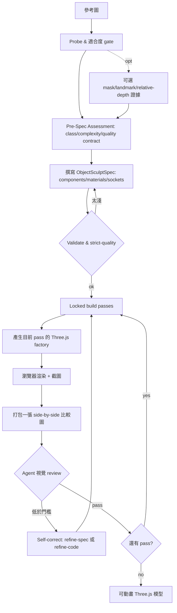

# img2threejs 技術分析報告

> 標的：`https://github.com/img2threejs/img2threejs`（Apache-2.0、Python、12,695★、v1.4.4、建於 2026-07-15、2026-08-22 仍更新）
> 本報告為 R1 首輪產出，資料來源為 repo 內文件（README / SKILL / ARCHITECTURE / TOKEN_COST / RESEARCH 註記）+ 通用技術背景。

---

## 1. 這個技術解決什麼問題？

img2threejs 解決的是：**「給定單張參考圖，產出『可直接在瀏覽器跑、可動畫、可編輯』的 Three.js 3D 模型」**。

更具體地說，它把過去「圖轉 3D」的三條常見路線（photogrammetry 攝影測量、mesh extraction 網格萃取、下載現成藝術包）全部排除，改為：**以程式（procedural）重建**。輸入一張物件參考圖，輸出一個 TypeScript 的 `createXxxModel(spec)` factory，呼叫後回傳一個帶完整 runtime 階層（pivot、socket、collider）的 `THREE.Group`。

核心主張可以拆成四個可驗證的面向：

| 面向 | 主張 | 對應產出 |
|---|---|---|
| 純程式 | 非網格檔、非下載、非攝影測量 | 可 diff 的 TypeScript + JSON spec（數 KB，非數 MB mesh） |
| 品質受控 | 每一 pass 有 gate，未達標不放行 | strict-quality、Divine Eye、render-review loop |
| 可動畫 | 不是「一團靜止的 lump」 | `root.userData.sculptRuntime` 暴露 nodes/sockets/colliders/destruction groups |
| Token 高效 | 只把模型 token 花在視覺判斷與寫程式上 | 確定性 Python 腳本負責驗證/gating，單物件約 80k–180k tokens |

問題描述的模糊之處：
- **「3D 模型」範圍**。它明確只強項於 hard-surface（硬表面）物件；角色是「風格化重建」而非寫實 likeness；環境/場景/世界級重建仍在 roadmap（v1.6+）。若使用者預期「任意影像 → 任意形狀的高保真模型」，此技術達不到。
- **「參考圖」張數**。單張圖無法揭露背面；對不可見面採「鏡像可見面」推測並標低信心，而不是憑空捏造。多視圖視覺外殼（visual hull）為 opt-in，非預設。
- **Token 成本是對的衡量單位嗎**。對使用 AI coding agent 的人有意義；對只想「快速拿一個 GLB/網格」的人，此技術繞了遠路。

---

## 2. 這個問題為什麼會發生？（背景）

> 以下區分「文章中明確提到」與「通用技術背景」。

### 2.1 問題根源：圖→3D 的三條舊路線各有代價

repo 明確排斥的三條路線，各自在歷史上是「圖轉 3D」的主流，但都有根本限制：

| 路線 | 機制 | 代價（通用技術背景） |
|---|---|---|
| 攝影測量 Photogrammetry | 多視圖影像三角化重建稠密點雲→網格 | 需要多張圖、多角度；產出是巨型不可編輯網格；對單張無解 |
| 網格萃取 Mesh extraction | 從 SDF／voxel／點雲跑 marching cubes 等等值面萃取 | 產生三角網格巨檔；銳利邊被圓化；非參數化，難編輯 |
| 下載藝術包 | 直接找現成模型拼裝 | 不是「重建」；與參考圖不像；版權/授權不可控 |

三條路線共同的痛點（通用技術背景）：**產出都是「不可編輯的稠密網格」**。對「要在瀏覽器裡渲染並讓它動起來」的用途，這些網格是死的：沒有 pivot、沒有 socket、沒有命名部件、沒有動畫掛鉤。改一行動畫得回 3D 軟體改原始檔再重新導出。

### 2.2 為什麼是「程式重建」來解

repo 給的論證（文章明確提到）是 token 效率：以往 AI agent 的圖轉 3D 迴圈把 token 燒在機械工作上——每 pass 重讀整個模型、逐像素打分數、手動驗證 JSON、重跑已做過的步驟。img2threejs 把這些全部推給確定性 Python 腳本（純 stdlib、零依賴），模型 token 只花在兩件事：**看一張 side-by-side 比較圖、決定 pass/fail**；以及**寫目前的 code pass**。

### 2.3 技術背景：Three.js 與「可動畫」需求

通用技術背景：Three.js 的場景圖（scene graph）是階層式的 `THREE.Group`，子節點有各自的 transform。要做到「可動畫」，模型必須是**命名、可定位的部件樹**（哪個是握把、哪個是輪子、哪個是關節），而不是一坨沒有名稱的三角面。這是 img2threejs 輸出 `THREE.Group` 而非 `.glb` mesh 的原因——輸出形態直接由「要在瀏覽器可動畫」這個需求決定。

---

## 3. 這個技術是如何解決該問題的？

核心是**一個「分階段雕刻 pipeline」＋「每階段 gate」＋「自我修正迴圈」**，由確定性腳本做驗證、agent 視覺做唯一准駁。

### 3.1 Pipeline 主流程



### 3.2 八個 build passes（固定順序，逐一解鎖）

`blockout → structural → form → material → surface → lighting → interaction → optimization`

每個 pass 只在上一 pass 被 review 且接受後解鎖。`continue` 的成立條件：真實 render + 比較圖 + agent 視覺分數達門檻 + 每個 identity-defining feature 達自身門檻。

### 3.3 Gate 系統

| Gate | 作用 |
|---|---|
| Suitability | 這張圖是不是合格的 3D 標的 |
| Pre-spec / strict-quality | spec 深度不足即擋在產生程式碼前（複合物件不得用單一 root spec） |
| Screenshot feedback | `continue` 必須有 render + 比較圖 + 通過的視覺分數 |
| Action-ready | 模型經 `root.userData.sculptRuntime` 暴露 runtime 階層（pivots/sockets/colliders） |
| Attachment correctness | 子部件宣告如何接在父部件上，確保不浮空 |
| Material & lighting realism | 獨立 PBR channel + 真實光，不把 albedo 冒充成 roughness |
| Divine Eye | 零 token 的多訊號確定性 review harness；硬 gate 先於軟 gate |

### 3.4 Self-correction 迴圈（每次 pass 後唯一決策）

agent 在每次 pass 後選**剛好一個**動作：

```
continue        → 進下一 pass
refine-spec     → spec 錯/太淺，修正後重新 validate
refine-code     → spec 對但 geometry/material/lighting 不符，改程式
request-input   → 需要更多輸入（例如更多視圖）才能判定
stop            → 此圖達不到宣稱的 fidelity，是合法結果
```

### 3.5 為什麼 token 高效（repo 明列六點）

| 機制 | 效果 |
|---|---|
| Scripts enforce, model judges | 腳本不評視覺；token 只花在「看一張比較圖決定 pass/fail」 |
| 零依賴 | 純 Python 3.10+ stdlib，無 pip/PIL/numpy/Playwright，PNG 用 `struct`+`zlib` 讀寫 |
| Pass-gated generation | 只產生目前解鎖的 pass，模型不每次重讀/重產生整個模型 |
| Fail fast 於 codegen 前 | strict-quality gate 擋下淺 spec，不浪費 token 渲染沒定義好的模型 |
| 一圖一 review | 每次 pass 只從一張打包比較圖判斷，不散落一堆截圖 |
| 文字輸出 | 輸出可 diff 的 TS + JSON spec，可版本控管 |

量化（TOKEN_COST.md）：單物件總 token 約 **80k–180k**；其中 render-review loop（5–8 個 cycle）佔最大宗，約 30k–70k。

### 3.6 角色／CS2 的額外路徑

- **角色（character）**：走解剖學感知軌道（頭部單位比例、面部 landmarks、pose），另有 opt-in 的 projection-first 路徑（fit 參數化模板到 landmarks → de-light → camera-match → 投影貼圖）最大化 likeness，逐區回報信心。
- **CS2 武器**：family-specific 元件契約；component-coverage 與 map-stripped blockout gate 防止「漂亮的貼圖取代真實結構」。

---

## 4. 是否存在解決類似問題的其他技術 / 框架 / 思考方式？

### 4.0 第二大腦對照說明

依 mybrain-read 查詢結果：

| 查詢 | 結果 |
|---|---|
| img2threejs / three.js / threejs | **第二大腦無此主題**，首次調研 |
| TRELLIS / TripoSR / InstantMesh / NeRF / Gaussian / image-to-3D | **無任何命中**，未見既有判定 |
| 3D 重建相關 | 僅命中 `LingBot-Map`（判定總表 49 筆「不採用」之一），屬 streaming 3D reconstruction，與「靜態單圖→可編輯模型」問題域不同 |
| 技術取捨準則（骨幹） | 見下方 §4.3，判定語意與推薦方向與「照通則」不同 |

因此 §4 的替代方案是依**通用技術背景**列出的同級方案，並逐項對照他「技術取捨準則」的判準指出契合或衝突。未查到任何替代方案在第二大腦有定稿判定。

### 4.1 替代方案 DA 表

| 技術名 | 技術解法 | 技術使用前提 | 技術使用副作用 | 技術使用預期效果 |
|---|---|---|---|---|
| **TRELLIS.2**（微軟，O-Voxel 稀疏體素 + Sparse Compression VAE + 階段式生成） | 從單圖生成稠密、field-free 的 3D 表徵（可處理開放/非流形/封閉表面）；輸出為 `MeshWithVoxel` | 4B 參數、H100-class GPU、≥24GB VRAM、CUDA 12.4、Linux | 輸出是一整塊不可編輯網格（無 parts/pivots/sockets/skeleton）；單圖資訊量上限仍在 | 最大可表示力（高保真、任意拓撲）；零語義（不可編輯） |
| **影像式重建（photogrammetry／NeRF／3D Gaussian Splatting 等）** | 多視圖或優化-based 還原稠密幾何/輻射場 | 需多張影像或專用硬體/長優化；NeRF 需體積渲染時間 | 產出巨型不可編輯網格或體素場；難以在瀏覽器輕量渲染；單圖無解 | 幾何精度高；但「可編輯、可動畫、輕量」三個屬性弱 |
| **現成 3D 資產庫／Blender 手動建模** | 下載或手建模型 | 要有符合需求的資產或建模人力；無需 AI | 與參考圖不像；非自動化；授權/版權需管理 | 品質可人工保證；但非「重建」、不可擴展、成本高 |
| **自建 MVP 程式重建管線（理解優先）** | 依需求自己兜一套 procedural 重建（理解本質後再決定） | 不熟悉或不穩定就應先自己兜；需投入時間 | 需自行驗證品質、自建 gate；初期不如現成方案強 | 對「可編輯 + 可動畫」需求最貼合；符合「理解優先」取捨準則 |

### 4.2 各自切入點差異

| 方案 | 切入點 |
|---|---|
| TRELLIS.2 | **可表示力**優先：犧牲語義（不可編輯）換取形狀自由度。是 img2threejs 的反向極端（max 可表示力 / min 語義）。 |
| 影像式重建 | **幾何保真**優先：追求真實幾何/輻射場，犧牲可編輯性與輕量性。 |
| 資產庫／手動建模 | **人工品質**優先：繞過自動化，換取完全可控。 |
| img2threejs | **語義與可編輯性**優先：輸出命名部件樹（14 種 primitive），犧牲可表示力。其 repo 自評「max 語義 / min 可表示力」，且**管線不偵測「此形狀不可表示」**，只偵測「render 分數低」——這是它與 TRELLIS.2 的核心差距。 |

### 4.3 與他既有技術取捨準則的對照（骨幹檔）

第二大腦 `技術取捨準則.md`（`generated.by: claude-code/opus-5`、`status: draft`——**未經他 review 的 AI 草稿**）明列三條與此決策直接相關的判準，URL：https://github.com/FATESAIKOU/MyBrain/blob/main/%E6%8A%BD%E8%B1%A1%E7%90%86%E8%A7%A3/%E6%9C%AC%E8%B3%AA%E6%B4%9E%E5%AF%9F/%E6%8A%80%E8%A1%93%E5%8F%96%E6%84%84%E5%87%86%E5%89%87.md

| 他的判準 | 內容 | 對本標的的意涵 |
|---|---|---|
| **理解優先：先自己兜** | 不夠穩定或不熟悉 → 先自己兜以理解本質，MVP 後才決定下一步 | img2threejs 專案極年輕（2026-07 建）、單人維護，屬「不穩定」——依此準則，這**不是採用障礙，而是「先自己兜」的觸發條件**，而非直接採用現成 |
| **Reject ≠ 沒價值** | 被拒的仍抽取「需求理解」與「方案方向」 | 即使判不採用 img2threejs，仍值得抽取其「pass-gated + gate 化驗證」的管線設計方向 |
| **MVP → Feature 唯一閘門是能否影響個人 workflow** | 進 Feature 的唯一標準是是否進他日常 workflow | img2threejs 是 AI agent 的 3D 模型生成 skill，屬「工具」層級；要進他 Feature 必須證明能影響他個人 workflow（他第二大腦目前**無任何 3D／前端模型生成專案**掛勾，見 step1 查詢） |

### 4.4 與通則推薦的衝突（查詢最有價值處）

- **通則傾向**：img2threejs 是熱門（12.7k★）且能力明確的「圖轉 3D」工具，容易直接推薦「採用現成」。
- **他的準則衝突**：依「理解優先」與「Reject 觸發條件」，他更可能**先自己兜一個 MVP 去理解「如何從單圖做可編輯 3D 重建」的本質**，而非直接採用這個極年輕的單人專案。若照通則推「直接用 img2threejs」會推向他「不熟悉就先自己兜」的反面。
- **可抽取的方向**：即便不採用，img2threejs 的「確定性腳本做驗證、模型 token 只做視覺判斷」的 token 效率設計，與他「Agent 約束放 harness（驗證規則程式化）」的信念高度同構，是可抽取的需求理解與方案方向。

### 4.5 反面論證（對照表）

| 維度 | 採用現成 img2threejs | 自兜 MVP 理解本質 |
|---|---|---|
| 理解本質 | 弱（只用，不理解機制） | 強（符合理解優先） |
| 專案穩定性風險 | 高（2026-07 建、單人、bus factor 低） | 低（自己可控） |
| 達到可動畫模型的速度 | 快（開箱即用） | 慢（需自行兜 gate/pipeline） |
| 進 Feature 的可行性 | 需證明進 daily workflow | 同樣需證明 |
| token 效率設計借鑑 | 可直接沿用 | 需自行實作 |

---

*（本輪無 User Q&A。如有質問型追問，將追加至 `## 5. User Q&A`。）*
