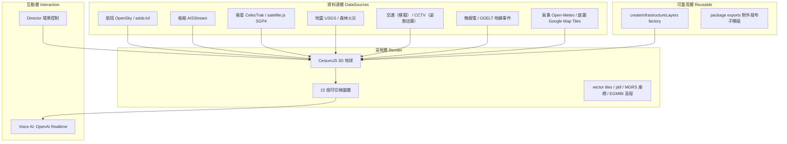

# gods-eye-view 技術分析報告

> 標的：`https://github.com/bilawalsidhu/gods-eye-view`（license=Other、JS 為主要語言、37,834★／7,623 forks、homepage `maptheworld.ai`、建於 2026-06-22）
> 定位：**瀏覽器中的偵察衛星模擬器，資料為真**（recon satellite simulator in your browser, real data）。
> 本報告為 R1 首輪產出，資料來源為 repo 內文件（README / DATA_SOURCES.md / docs/CURRENT-STATE.md / docs/INFRASTRUCTURE-LAYERS.md / package.json）+ 通用技術背景。

---

## 1. 這個技術解決什麼問題？

gods-eye-view 解決的是：**把「全球即時公開資料」聚合並以『單一、可探索的 3D 地球』方式呈現，讓非專業使用者像操作一顆偵察衛星一樣俯瞰全球實況。**

更具體來說，它整合了**航班、船舶、衛星、地震、森林火災、交通、無線電訊號、CCTV、地緣事件（GDELT）**等多種公開即時資料源，全部繪製在同一顆 CesiumJS 3D 地球之上。它不是資料視覺化儀表板，而是「以一個連續的世界座標系，把所有公開時空資料對齊到同一個畫面」。

核心主張可拆成幾個可驗證面向：

| 面向 | 主張 | 對應產出 |
|---|---|---|
| 真實資料 | 「資料是真的」，即時或定期更新 | 30+ 個即時資料源（OSM、OpenSky、adsb.lol、AISStream、CelesTrak、USGS、Open-Meteo、GDELT、各城市 CCTV API…） |
| 3D 地球呈現 | 單一、可縮放探索的球體 | CesiumJS 3D 地球 + 15 個可切換圖層 |
| 語音介面 | 用自然語言對地球下指令 | OpenAI Realtime API 驅動的 voice AI |
| 偵察衛星語境 | 給使用者「衛星俯瞰」的角色設定 | 瀏覽器內的衛星式 UI 語境（非真實遙測） |

問題描述的模糊之處：
- **「公開數據」的授權與即時性不一**。資料源彼此授權不同（部分非商用、部分受 ToS 限制），且「交通」是模擬資料、「CCTV 姿態」是估算值——並非所有圖層都是「真即時」。
- **「3D 地球觀測台」的用途界定**。README 自述為「探索／娛樂性質」的病毒式開源專案，非地理資訊分析工具，也不做個案調查——它明確畫出「不做的界線」（無人名搜索、無人臉辨識）。若使用者預期「OSINT 調查工具」，此技術達不到。

---

## 2. 這個問題為什麼會發生？（背景）

> 以下區分「文章中明確提到」與「通用技術背景」。

### 2.1 問題根源：公開資料分散、且缺乏統一時空視角

repo 明確提到的動機（Why This Exists）：全球的公開即時資料（航班、船舶、衛星、地震、交通、CCTV）分散在各自獨立的平台與 API，沒有一個地方能「一眼看到全世界正在發生什麼」。要理解地球尺度的事件，需要同時開多個網站交叉比對。

通用技術背景：地理空間資料（GEOINT）長年被分割成垂直領域——航班走 FlightRadar 類、船舶走 MarineTraffic 類、衛星走 Celestrak 類。每個領域有自己的資料模型、自己的地圖、自己的授權。跨領域的「統一視角」因為資料模型不同、座標系不同、授權不同而長期空缺。

### 2.2 為什麼現在才成真

通用技術背景的三個成熟條件：
- **免費、可嵌入的 3D 地球引擎**（CesiumJS 開源化）降低了「在瀏覽器畫一顆真實地球」的成本。
- **公開即時資料 API 大量出現**（OpenSky、adsb.lol、AISStream、Open-Meteo、USGS、各城市開放 CCTV 等），多數不需金鑰或免費額度即可取用。
- **瀏覽器即時通訊與 WebSocket 技術成熟**，可低延遲訂閱航班/船舶/無線電等動態資料流。

### 2.3 repo 明確提到的額外條件：病毒式傳播與開源化

README 提到：此專案源自一個 viral YouTube 系列（WorldView），於 2026-08 登上 GitHub Trending #1、Product Hunt #8，並開源；hosted 版由 Halfpixel 提供（`maptheworld.ai`）。亦即「真實資料 + 3D 地球 + 語音控制」的組合具備可觀看性與傳播性，是它走紅的條件。

---

## 3. 這個技術是如何解決該問題的？

核心是**一個 CesiumJS 3D 地球 + 多層即時資料源 + 可重用基礎設施層 + 語音 Agent 的四層架構**。

### 3.1 整體架構

### 3.2 資料源整合（DATA_SOURCES.md 明列）

| 資料域 | 資料源 | 資料性質 |
|---|---|---|
| 航班 | OpenSky、adsb.lol | 即時 |
| 船舶 | AISStream | 即時 |
| 衛星 | CelesTrak、satellite.js（SGP4 軌道傳播） | 定期更新 |
| 地震/火災 | USGS | 即時 |
| 交通 | 模擬資料 | 模擬（非真即時） |
| CCTV | 各城市開放 CCTV API | 即時（但鏡頭姿態為估算） |
| 無線電/事件 | 開放無線電、GDELT | 即時 |
| 氣象/底圖 | Open-Meteo、Google Map Tiles | 定期/即時 |

每筆資料源在 DATA_SOURCES.md 都附帶授權或限制說明，並在 README 做授權 carve-out（如 TeleGeography 非商用、OpenSky 非商用、Google ToS）。**授權治理是「公開數據」落地的前提**——不能假設所有公開資料都可無限制商用。

### 3.3 核心技術棧（package.json）

| 類別 | 依賴 | 用途 |
|---|---|---|
| 3D 引擎 | `cesium@1.124` | 3D 地球渲染 |
| 衛星軌道 | `satellite.js@6`（SGP4） | 衛星位置傳播 |
| 座標/高程 | `mgrs`、`egm96-universal` | 軍事網格座標、EGM96 大地水準面高程 |
| 向量圖磚 | `@mapbox/vector-tile`、`pbf` | 向量地圖圖磚解碼 |
| 建置/測試 | `vite@6`、`puppeteer` | 開發伺服器、無頭瀏覽器驗證 |

無框架（vanilla CesiumJS）；語音用 OpenAI Realtime API。

### 3.4 可重用設計（INFRASTRUCTURE-LAYERS.md）

repo 已把「資料中心、水壩等基礎設施層」抽成可重用的 `createInfrastructureLayers` factory，並透過 package 的 `exports` 欄位**對外發布多個可重用子模組**。這意味著它不只是單一展示站，而是刻意做成「可被其他專案 import 的 3D 圖層工廠」。狀態管理採 owners 化、場景由 Director 控制、voice ownership 有獨立架構。

### 3.5 「不做的界線」

README 明確列出技術刻意不支援的事：**無人名搜索、無人臉辨識**。這是為了避免把「公開資料觀測台」誤用成「人肉搜索工具」——是產品邊界，也是授權/倫理上的自我設限。

---

## 4. 是否存在解決類似問題的其他技術 / 框架 / 思考方式？

### 4.0 第二大腦對照說明

依 mybrain-read 查詢結果：

| 查詢 | 結果 |
|---|---|
| gods-eye-view / gods-eye / 3d-earth / 地球觀測 | **第二大腦無此主題**，首次調研 |
| Cesium / Google Earth / Mapbox / three.js | **無任何命中**，未見既有判定 |
| img2threejs（Three.js 域） | 有判定：**Reject**（日誌 2026-08-22），理由「無圖片轉 3D 需求＋與手上事過度同構」——與本標的解決的問題不同（圖轉 3D vs 公開資料 3D 地球） |
| Maigret（OSINT 域） | 有判定：**採用**（2026-06-27），OSINT username 調查引擎，納入日常 workflow |
| LingBot-Map（streaming 3D reconstruction） | 判定總表「不採用」之一，與「3D 地球視覺化」問題域不同 |
| 地理/資料視覺化（GEOINT 概念） | 僅命中「伊朗戰爭分析框架」（stable、human:fatesaikou）——一個以空間/貿易/戰略資料做地緣分析的框架，屬想法層，無工具判定 |
| 技術取捨準則（骨幹） | 見 §4.3，判定語意與推薦方向與「照通則」不同 |

因此 §4 的替代方案是依**通用技術背景**列出的同級方案，並逐項對照他「技術取捨準則」的判準指出契合或衝突。未查到任何替代方案在第二大腦有定稿判定。

### 4.1 替代方案 DA 表

| 技術名 | 技術解法 | 技術使用前提 | 技術使用副作用 | 技術使用預期效果 |
|---|---|---|---|---|
| **CesiumJS / Google Earth（3D 地球引擎層）** | 直接拿成熟 3D 地球引擎自己聚合資料源 | 要自己接各資料 API、自己寫圖層/語音；Cesium 開源、Google Earth 需金鑰 | 工作量大；授權治理要自己做；無現成語音介面 | 完全掌控；正是 gods-eye-view 的底層，屬「自己做引擎之上的那層」 |
| **Mapbox / Leaflet + 2D 地圖疊圖** | 用 2D 底圖疊多層資料，捨棄 3D 球體 | 需要即時資料源 + 前端地圖庫；比 3D 輕量 | 無「衛星俯瞰」沉浸感；多圖層效能管理不同 | 輕量、上手快；但失去「單一世界座標 3D」的語境 |
| **FlightRadar24 / MarineTraffic 等垂直平台** | 各領域現成即時觀測平台 | 每個領域分開用；多為封閉或付費 | 無法跨域統一看；資料授權受限 | 單一領域資料最完整；但不解決「跨域統一視角」 |
| **自建 MVP 資料融合地球（理解優先）** | 依需求自己兜 Cesium 地球 + 選幾個資料源 | 不熟悉或不穩定就應先自己兜；需投入時間 | 初期不如現成專案完整；需自行治理授權 | 對「統一時空視角」需求最貼合；符合「理解優先」取捨準則 |

### 4.2 各自切入點差異

| 方案 | 切入點 |
|---|---|
| gods-eye-view | **跨域統一視角**優先：把航班/船舶/衛星/地震/交通/CCTV 全部對齊到單一 3D 地球，附語音介面，犧牲單一領域深度。 |
| CesiumJS/Google Earth 自建 | **引擎層**優先：用成熟地球引擎當基底，自己補資料與語音；與 gods-eye-view 是「用它的底層」，不是同層替代。 |
| Mapbox 2D 疊圖 | **輕量**優先：捨棄 3D 沉浸感換取快速上手與低資源。 |
| 垂直平台 | **單一領域深度**優先：FlightRadar 看航班最全，但不跨域。 |
| 自建 MVP | **理解本質**優先：先兜一個「Cesium + 3 個資料源」的迷你版理解機制，再決定要不要做大。 |

### 4.3 與他既有技術取捨準則的對照（骨幹檔）

第二大腦 `技術取捨準則.md`（`generated.by: claude-code/opus-5`、`status: draft`——**未經他 review 的 AI 草稿**）明列三條與此決策直接相關的判準，URL：https://github.com/FATESAIKOU/MyBrain/blob/main/%E6%8A%BD%E8%B1%A1%E7%90%86%E8%A7%A3/%E6%9C%AC%E8%B3%AA%E6%B4%9E%E5%AF%9F/%E6%8A%80%E8%A1%93%E5%8F%96%E6%84%84%E5%87%86%E5%89%87.md

| 他的判準 | 內容 | 對本標的的意涵 |
|---|---|---|
| **理解優先：先自己兜** | 不夠穩定或不熟悉 → 先自己兜以理解本質，MVP 後才決定下一步 | gods-eye-view 專案極年輕（2026-06 建）、license=Other、單人維護風險——依此準則，這**不是採用障礙，而是「先自己兜」的觸發條件**，而非直接採用現成 |
| **Reject ≠ 沒價值** | 被拒的仍抽取「需求理解」與「方案方向」 | 即使判不採用 gods-eye-view，仍值得抽取其「跨域資料源對齊到單一 3D 座標系」的方向，以及 `createInfrastructureLayers` 的圖層工廠可重用設計 |
| **MVP → Feature 唯一閘門是能否影響個人 workflow** | 進 Feature 的唯一標準是是否進他日常 workflow | gods-eye-view 是「探索/娛樂」向的公開資料觀測台；要進他 Feature 必須證明能影響他個人 workflow。他第二大腦**目前無任何「3D 地球 / 地理資料視覺化」進行中專案**（step1 查證：下一步清單 45 條、專案現況表皆無），且他的地理資料使用目前落在「伊朗戰爭分析框架」這類分析思考，不是「觀測台」工具 |

### 4.4 與通則推薦的衝突（查詢最有價值處）

- **通則傾向**：gods-eye-view 是熱門（37.8k★）且病毒式走紅的 3D 地球觀測台，容易直接推薦「採用現成」或「納入靈感」。它與他**已採用的 OSINT 工具 Maigret**（username 調查）同屬「公開資料 / OSINT」域，看似可類比推薦。
- **他的準則衝突一（理解優先）**：依「理解優先」與「Reject 觸發條件」，他更可能**先自己兜一個 Cesium 地球 MVP** 去理解「如何把多個公開資料源對齊到單一 3D 座標系」的本質，而非直接採用這個極年輕、license=Other、單人維護風險高的專案。若照通則推「直接用 gods-eye-view」會推向他「不熟悉就先自己兜」的反面。
- **他的準則衝突二（workflow 閘門）**：gods-eye-view 屬「探索/娛樂」向，**沒有進入他任何進行中專案或個人 workflow**。即便它與 Maigret 同屬公開資料域，Maigret 之所以被採用是因為「理解問題本質後實測可用、包成指令納入日常 workflow」；gods-eye-view 的「觀測台」型態無法直接套入他那種「指令式、可程式化」的日常 workflow。
- **可抽取的方向**：無論採用與否，gods-eye-view 的「多源公開資料對齊到單一時空座標系」與「`createInfrastructureLayers` 圖層工廠可重用介面」是可抽取的需求理解與方案方向。

### 4.5 反面論證（對照表）

| 維度 | 採用現成 gods-eye-view | 自兜 MVP 理解本質 |
|---|---|---|
| 理解本質 | 弱（只用，不理解機制） | 強（符合理解優先） |
| 專案穩定性風險 | 高（2026-06 建、license=Other、單人、bus factor 低） | 低（自己可控） |
| 達到可用地球觀測的速度 | 快（開箱即用） | 慢（需自行接資料源、建圖層） |
| 進 Feature 的可行性 | 需證明進 daily workflow（目前無掛勾） | 同樣需證明 |
| 資料融合架構借鑑 | 可直接沿用 `createInfrastructureLayers` | 需自行實作 |

---

*（本輪無 User Q&A。如有質問型追問，將追加至 `## 5. User Q&A`。）*
